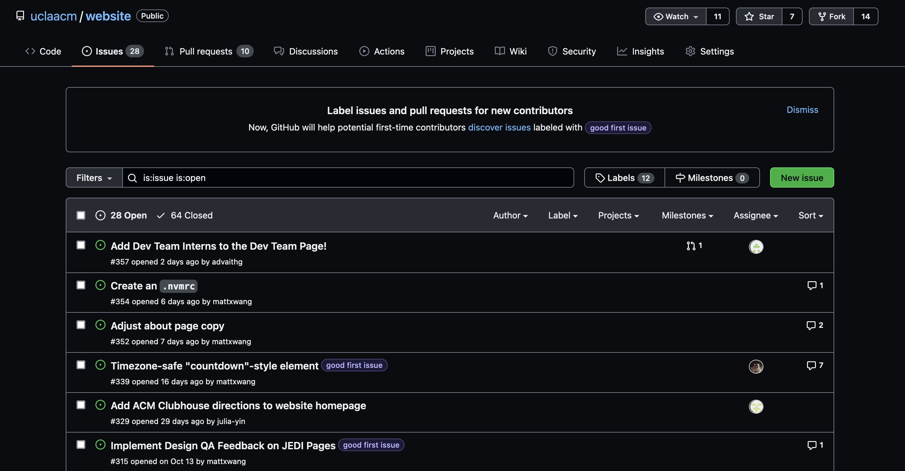

# Intermediate CSS & Github Workflows

How can we make websites pretty? In this session, we'll discuss about the design and layout of items within CSS, specifically the box model and layout, as well as newer aspects of CSS such as Flexbox and Grid! On top of that, we'll also discuss how we can use Github to collaborate with others on projects!

## Referenced Resources

- [TeachLA Dev Training: Intro to HTML/CSS](https://github.com/uclaacm/teach-la-dev-training/tree/main/intro-to-web-dev/01_html_css)
- [TeachLA Dev Training: Github & Jekyll](https://github.com/uclaacm/teach-la-dev-training/tree/main/intro-to-web-dev/04_github_and_jekyll)
- [Transfer Accelerator Portfolio Website Workshop: Intro to HTML/CSS Structure](https://github.com/uclaacm/transfer-accel-portfolio-website-workshop/tree/main/01-html-css-structure-style)
- [ACM Hack Hackschool: Introduction to HTML/CSS](https://github.com/uclaacm/hackschool-f21/tree/main/session-1-intro-to-html-css)

## Table of Contents

- The Box Model
  - Content
  - Padding
  - Border
  - Margin
  - Box-Sizing
- Display
  - display:inline
  - display:block
- Position
- Float
- Flexbox
  - Flex Axis
  - Flex Justify Vs. Align
    - Content Vs. Items
  - Flex Containers Vs. Flex Items
  - Flex Grow Vs. Flex Shrink
- CSS Grid

  - grid-template-columns and rows

- Github As A Collaboration Tool
  - Organizations, Teams, Projects
  - Issues
  - Branches
    - The Main Branch
    - Working on New Branches
  - Merging and Merge Conflicts
  - Linting, Github Actions
  - Pull Requests & Code Review

## The Box Model

### Content

### Padding

### Border

### Margin

### Box-Sizing

## Display

### Display:Inline

### Display:Block

## Position

## Float

## Flexbox

### Flex Axis

### Flex Justify Vs. Align

### Content Vs. Items

### Flex Containers Vs. Flex Items

### Flex Grow Vs. Flex Shrink

## CSS Grid

### grid-template-columns and rows

## Github as a Collaboration Tool

Last week, we saw how Git and Github as a version control system can be used to back your data up, keep track of history, and host your website online. We also learned how to save this history and maintain it locally as well as online. This time, we're going to cover another important feature of Github - using it for collaboration.

### Organizations, Teams, Projects

Some useful features Github offers for groups of people working on projects include Organizations, Teams and Projects.

[Organizations](https://docs.github.com/en/organizations) on Github are basically groups of people working on multiple repositories. For an example, we can look at the [ACM at UCLA](https://github.com/uclaacm/) organization, where this repository along with most other repositories we work on are located.

Sometimes, Organizations can get a little _large_ (like ACM!). Not everyone in the organization works on every repository, so members are grouped into [Teams](https://docs.github.com/en/organizations/organizing-members-into-teams/about-teams) that work on specific repositories!
An example of this at ACM is the [Dev Team](https://github.com/orgs/uclaacm/teams/dev-team), which has the repositories we maintain. Teams can also have sub-teams that work on even more specific repos.

[Projects](https://docs.github.com/en/issues/trying-out-the-new-projects-experience/about-projects) are a feature Github has to help plan and track work across organizations and teams.

### Issues

The [Issues](https://docs.github.com/en/issues/tracking-your-work-with-issues/about-issues) tab of a repository is used to organize work within a project, and is a way to view a lot of the work that needs to be done on a project.



Within an issue, you can view an overview of what needs to be done and a list of labels associated with it! If you feel like you want to tackle a problem, you can contact someone who's in charge of or a "maintainer' of the repository, and they'll assign an issue to you!

When an issue is assigned to you, you contact whoever wrote the issue to ask for any further questions you have, and you're responsible for fixing it!

### Branches

If you click on the [branches](https://docs.github.com/en/github/collaborating-with-pull-requests/proposing-changes-to-your-work-with-pull-requests/about-branches) section of a repository, you can see a list of a bunch of different versions of the code within the repository. Branches are a way for you to work on a new feature in isolation of all of the work that other people may be doing on a project at the same time. Branches enable you to work on something in an isolated environment, without being affected by the changes other people make to the repository while you're doing it, and making sure you can ensure whatever you're doing works before shipping it.

The most important one is the "main" or "master" (default) branch of the repository.

### The Main Branch

The main branch is the one that is displayed whenever someone visits your repository, or the initial one when someone clones a repository. This is also usually the branch that is deployed on any website.

### Working on New Branches

In order to isolate your work from other people's work, you can check out a new branch to look at your changes! If you're a collaborator on a repository (which you are if you accepted the ACM@UCLA github invite email!) you are able to make a new branch and start working on a change right away.

(If you are not a collaborator for a repository, you'll have to [fork the repository](https://docs.github.com/en/get-started/quickstart/fork-a-repo) instead of creating a new branch directly!)


To see a list of all the branches that exist, you can run

```sh
$ git branch
```

to see a list of all of the branches that you can change to.

To switch to another branch, you can run

```sh
$ git checkout NAME_OF_BRANCH
```

which is the same as

```sh
$ git switch NAME_OF_BRANCH
```

to view another branch!

Before making a new branch, it's important that you always PULL the latest changes to a repository by running

```sh
$ git pull
```

so that you always get the most up-to-date version of the repository before changing branches!

The way that you can make a new branch is by running

```sh
$ git checkout -b NAME_OF_BRANCH
```

Let's break down what this command does. Git checkout tells git that you want to switch the version of code you are looking at to the one that's contained within the other branch, and the -b command tells git that you want to create a new branch that hasn't existed yet. This creates a new branch in git history that's based off of the branch that you were currently developing in.

The above command is equivalent to

```sh
$ git branch NAME_OF_BRANCH
$ git checkout NAME_OF_BRANCH
```

From here, you can do all the development that you want from a new branch, and when you push, you push to this specific branch in the remote repository.

### Merging

If you want to "merge" a branch into your current working branch, run

```sh
$ git merge NAME_OF_BRANCH
```

to merge the contents of the other branch into your current working branch.

This merges NAME_OF_BRANCH into the branch you're currently working on.

### Merge Conflicts

Occasionally, you will run into merge conflicts within files, which means that the version of the file between the two branches you are merging have conflicting lines. You can make them agree within your text editor, choosing which version of the files you want to save when you merge.

For a merge conflict, you go through the conflict details and select which lines you want to keep - for each conflict you can pick the difference in one of the files, or you can choose to keep both.

### Linting and Github Actions

[Github Actions](https://github.com/features/actions) enable you to run checks or automatically perform actions to make sure your code is up to a certain standard. These usually include **linting** checks, which means your code follows a set of formatting guidelines along with checks to ensure your code builds and deploys successfully. For the ACM at UCLA website, these checks automatically occur on every Pull Request, but it is also possible to set them up so they occur every time a commit is made.

### Pull Requests and Code Review

From your branch, you can make a pull request from your branch to the main branch. After someone reviews your code and changes (or extra tests to pass), they'll either approve it to be merged into the main branch, or they will ask for revisions and changes to be made before another review through a process called a **code review**.

The procedure for pushing any feature or change you made to production or deployment usually involves all the things you just learned.

- First, you find an issue you like and are assigned the issue to resolve.
- You pull the latest version of the repo and make a branch off `main` to resolve your issue.
- You make all the changes you have to on your branch and make sure it works
- You push your changes to remote, and open a Pull Request to merge your branch into `main`.
- Your code runs through any previously set up checks, including one to check if there's a merge conflict.
- If there's a merge conflict, you merge `main` into your branch to resolve the merge conflict, and then push your changes again.
- Once your Pull Request passes all the checks, someone will review your code.
- If they request changes, you make the changes, and go back to the previous step.
- Once you're done with code review, you can merge your branch into `main` and delete the branch and the PR, and close the issue.

And that's it! You've now made a change that's been deployed!
