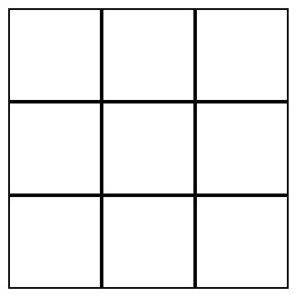

# Intermediate CSS & Github Workflows

How can we make websites pretty? In this session, we'll discuss about the design and layout of items within CSS, specifically the box model and layout, as well as newer aspects of CSS such as Flexbox and Grid! On top of that, we'll also discuss how we can use Github to collaborate with others on projects!

## Referenced Resources

The CSS Sections Are Pulled From The Learning Lab Crash Course!

- [Learning Lab Crash Course: Intermediate CSS](https://github.com/uclaacm/learning-lab-crash-course-su20/tree/main/02-intermediate-css)
- [Learning Lab Crash Course: Flexbox/Grid](https://github.com/uclaacm/learning-lab-crash-course-su20/tree/main/04-flexbox-grid)

## Table of Contents

- [The Box Model](#the-box-model)
  - [The Content Area](#the-content-area)
  - [The Padding Area](#the-padding-area)
  - [The Border Area](#the-border-area)
  - [The Margin Area](#the-margin-area)
  - [Padding vs. Margin](#padding-vs-margin)
  - [Aside: the box-sizing property](#aside-the-box-sizing-property)
- [display:inline and display:block](#displayinline-and-displayblock)
- [The position property](#the-position-property)
  - [A quick aside on z-index](#a-quick-aside-on-z-index)
- [The float property](#the-float-property)
- [Flexbox](#flexbox)

  - [Creating rows and columns; understanding the problem](#creating-rows-and-columns-understanding-the-problem)
  - [Setting up flexbox](#setting-up-flexbox)
  - [Critical concepts in flexbox](#critical-concepts-in-flexbox)
    - [Flex axes and flow](#flex-axes-and-flow)
    - [justify-content](#justify-content)
    - [align-items, align-content](#align-items-align-content)
  - [Grow V. Shrink](#grow-v-shrink)
  - [CSS Grid](#css-grid)

- [Github As A Collaboration Tool](#github-as-a-collaboration-tool)

- [Organizations, Teams, Projects](#organizations-teams-projects)
- [Issues](#issues)
- [Branches](#branches)
  - [The Main Branch](#the-main-branch)
  - [Working on New Branches](#working-on-new-branches)
- [Merging and Merge Conflicts](#merging-and-merge-conflicts) -[Linting, Github Actions](#linting-github-actions)
- [Pull Requests & Code Review](#pull-requests-code-reiew)

## CSS Box Model

The **box model** is a core part of HTML and CSS, and you'll likely hear about it more as you read web documentation, talk to web developers, and do front-end interviews. But what exactly does the box model mean?

The box model says that **every HTML element is really just a box**. Simple, right? But, there's a bit more. In particular, it says that each box is comprised of four (somewhat concentric) rectangles that describe the layout of element. These four rectangles (or areas, zones, parts), are called:

1. The Content Area
2. The Padding Area
3. The Border Area
4. The Margin Area

To see it in action, we can just run inspect element on whatever we want!

Let's go over all of them in action:

### Content

The content area contains, well, your content. By default, the size of this area is determined by the size of your content: a `400px` image will have a content area of size `400px`, and text _generally_ fills as much space as possible (though we'll go into this more in a bit). In addition, we've played around with the `width` and `height` attributes: by default, the `width` and `height` attributes only affect the content area.

This is the easiest area to think about and examine. We can do this with a very trivial code example:

```css
/* CSS file */
.box {
  width: 300px;
  height: 300px;
  background-color: blue;
}
```

```html
<!-- HTML FILE -->
<div class="box">I'm a box!</div>
```

### The Padding Area

Now, let's throw our next box in. The **padding** of a box surrounds the content area with whitespace. I You can control the `padding` of a box with a set of CSS properties, such as:

- `padding-top: 5px;`, which would add 5 pixels of padding to the top of a content area
- `padding-right: 5px;`, which would add 5 pixels of padding to the right of a content area
- `padding-bottom: 5px;`, which would add 5 pixels of padding to the bottom of a content area
- `padding-left: 5px;`, which would add 5 pixels of padding to the left of a content area
- `padding: 5px;`, which adds 5 pixels of padding to the top, right, bottom, and left of a content area

When we say _whitespace_, we mean that there is nothing there, _transparently_; that is to say, we will display whatever is the background of the element.

Let's also take a look at this with a code example. One very common use case of `padding` is to "pad" some text, to make it more visually appealing.

```css
/* CSS file */
.orange-box {
  background-color: orange;
  width: 200px;
  height: 200px;
}
.padded-orange-box {
  background-color: orange;
  width: 200px;
  height: 200px;
  padding: 10px;
}
```

```html
<!-- HTML FILE -->
<div class="orange-box">
  Why are spiders so good at making websites? Because they're great web
  developers!
</div>
<br />
<div class="padded-orange-box">
  Why are spiders so good at making websites? Because they're great web
  developers!
</div>
```

### The Border Area

Hopefully, the **border area** should be somewhat self-explanatory: it creates a visible border around your padding and content areas. Unlike padding, border related properties all add some sort of color, and can sometimes add patterns as well.

There are a plethora of different options to customize a border (and we recommend you take a look at some documentation when you have the chance), but for now, we'll examine the `border` property (which is in reality shorthand for `border-width`, `border-style`, and then `border-color`).

This is best explained visually. Let's look at this with another common code example, a simple "card" element:

```css
/* CSS file */
.text-card {
  width: 200px;
  height: 200px;
  padding: 10px;
  border: 1px solid black;
}
```

```html
<!-- HTML FILE -->
<div class="text-card">
  I never understood Fifty Shades of Gray - there are at least thousands in RGB
  color space.
</div>
```


Here, the `border: 1px solid black;` is telling us:

- the border should be `1px` wide
- the border should be `solid` (it could also be dashed)
- the border should be `black`

Also, note that the border goes around both the content and the padding! And, the border itself is adding to the size of our box: the total size of `.text-card` is actually `221px` now!

### The Margin Area

Last, but not least, let's talk about margin! Margin operates somewhat similarly to padding, in that we'll add some space around the element. Like `padding`, there's:

- `margin-top`
- `margin-right`
- `margin-bottom`
- `margin-left`
- and the shorthand `margin`

Let's take a look at an example with all of our elements in play, building on our card example:

```css
/* CSS file */
.text-card-mb {
  width: 200px;
  height: 200px;
  padding: 10px;
  border: 1px solid black;
  margin-bottom: 50px;
}
```

```html
<!-- HTML FILE -->
<div class="text-card-mb">
  I never understood Fifty Shades of Gray - there are at least thousands in RGB
  color space.
</div>

<div class="text-card-mb">
  Paradoxically, taking computer organisation has made my computer less
  organized; there's stacks and heaps of files everywhere now!
</div>
```


Notice that, in addition to the padding within the box, we've now added space between the boxes: `50px` to be exact!

There is one difference between the behaviour of margin and padding, other than their difference in order respective to the box model. Margins "collapse": that is to say, if two elements on top of each other have `margin-bottom: X;` and `margin-top: Y;`, the total space won't be `X + Y` (as it would for padding); instead, it'll _collapse_ the margins, and pick the larger item. We can see this with our text cards:

```css
/* CSS file */
.text-card-spaced {
  width: 200px;
  height: 200px;
  padding: 10px;
  border: 1px solid black;
  margin: 50px;
}
```

```html
<!-- HTML FILE -->
<div class="text-card-spaced">
  I never understood Fifty Shades of Gray - there are at least thousands in RGB
  color space.
</div>

<div class="text-card-spaced">
  Paradoxically, taking computer organisation has made my computer less
  organized; there's stacks and heaps of files everywhere now!
</div>
```


Note that the visual distance between the two cards is the same as our previous example, even though we've changed the `margin-bottom: 50px;` to `margin: 50px;`!

### Padding vs. Margin

Often times, you'll want to add some space to your website. You now have two great options in your toolkit: `padding` and `margin`. But, which should you pick?

If you wanted a one-liner, it would look something like this:

> Padding creates space inside an element, while margin creates space between elements.

## The `position` property

We have now discussed layout and spacing, but how do we determine the position of an element? It turns out, there will be many different ways to do so, but one of the earliest ways to do so was with the `position` property. It has five values:

- `static` (the default)
- `relative`
- `fixed`
- `absolute`
- `sticky`

Everything so far we have discussed is what happens when you set `position:static`; elements appear one after another, known as the "normal" flow.

The other `position` values change what the properties `top`, `right`, `bottom`, and `left` do - things we haven't discussed yet. Let's discuss them now!

Each of those properties are an _offset property_, in that they tell the browser how far from the "offset" to place the new content area: for example,

```css
.some-element {
  top: 30px;
  left: 45px;
}
```

Would place that element 30 pixels from the top, and 45 from the left of its reference point.

But what is the reference point? That's what each of `relative`, `fixed`, and `absolute` describe:

- `relative`: the reference point is where the content area would be normally, i.e. before using `top`, `right`, `bottom`, and `left`. In our example, this would shift our element 30 pixels down, and 45 to the right.
- `fixed`: the reference point is the **viewport**, which is a fancy name for the edge of the browser. In our example, our element would be 30 pixels down and 45 to the right of the top-left corner of the screen, and it'll stay there **even when we scroll**.
- `absolute`: the reference point is the first parent that has `position` not equal to `static` (choosing the entire document if needed). In our example, our element would be 30 pixels down and 45 to the right of the top-left corner of the top of the page, and will move away as we scroll.

These are harder to demonstrate with screenshots, so we recommend that you visit [this W3Schools Demo](https://www.w3schools.com/css/css_positioning.asp) for more information!

Okay, and what about `position: sticky`? This one is a bit more complicated, and depends on the scroll position of the website. From a high level,

- by default, we treat it as `postion: relative`
- if the user has "scrolled past" where the element is on the website, it then becomes `position: fixed`

Why would we want this property? It turns out, it's very useful in creating navigation bars and table headers - something you'll probably do as a web developer at some point.

You can see a demo and more information on the [MDN Page](https://developer.mozilla.org/en-US/docs/Web/CSS/position#Sticky_positioning).

### A quick aside on `z-index`

If you're thinking carefully, you might have the question: what happens when two elements overlap? What chooses what goes on top of what?

The answer is the `z-index` property, which we don't have too much time to go in-depth in the presentation. The very short answer is that if you think of the webpage as being governed by the x-axis and the y-axis, the natural "z-axis" would point at you, coming out of the monitor. By setting the `z-index` property, we can dictate the position of elements along this "z-axis". For example, an element with `z-index: 999` is "closer to you" than an element with `z-index: 100`, so it'll be on top. By default, elements have `z-index: 0`.

You should read more about `z-index`; the [MDN page](https://developer.mozilla.org/en-US/docs/Web/CSS/z-index) is pretty manageable.

## The `float` property

The `float` property is another CSS property that specifies position. It is used very frequently with objects appearing in the middle of text, like an image. If you've ever struggled with putting an image in-line with text in Microsoft Word or Google Docs, this is for you!

```css
.float-left {
  float: left;
  background: red;
}

.float-right {
  float: right;
  background: blue;
}
```

```html
<div>
  <div class="float-left">float left!</div>
  <div class="float-right">float right!</div>
  <p>
    You know, balloons tend to keep my spirits up. You know, balloons tend to
    keep my spirits up. You know, balloons tend to keep my spirits up. You know,
    balloons tend to keep my spirits up. You know, balloons tend to keep my
    spirits up.
  </p>
</div>
```


Note how the text wraps around to content not filled by each float - the object is placed "in the middle" of the text, so to speak.

At the end of the day, there's quite a bit more to floats (for example, you often have to use clearfixes or the `clear` property). However, we won't spend too much time on them, as floats are used less and less for layouts in favour of solutions like Flexbox or CSS Grid, both of which we'll cover as well!

## Flexbox

### Creating rows and columns; understanding the problem

Let's say I'm a farmer looking to build a neat little website to sell my crops online from. Let's first build our example "product card". For brevity's sake, we'll keep it in pure HTML with a little inline CSS:

```html
<!-- <ProductCard /> -->
<div class="product">
  <h3>Product Name</h3>
  
  <p>This is my product description</p>
</div>
```

Again, for the sake of brevity, let's call this component `<ProductCard />`. It looks like a fancy new tag name, but in reality it will just serve as a placeholder for where we copy and paste the HTML. Now, we have two ways to lay out our three product cards for corn, wheat, and barley: tables and flexbox.

Let's try table rows first:

```html
<table>
  <tbody>
    <tr>
      <td>
        <ProductCard />
      </td>
      <td>
        <ProductCard />
      </td>
      <td>
        <ProductCard />
      </td>
    </tr>
  </tbody>
</table>
```

Let's look at this on a webpage:


Doesn't look too bad! Let's throw in our content:


This is where the table layout starts to lose traction. Our cards aren't the same height, and hence not a proper _row_. That's not all, though. Here's a few things to consider:

- Our HTML document is now incredibly difficult to read.
  - This isn't just difficult to read as a dev - think about how screen readers are going to handle reading a **table** - intended to organize data - when we use them for layout purposes. **This leads to poor accessibility**.
- Did you notice our spacing was a little bit more than we bargained for?
  - The default style rules for table elements added on some padding to the interior of the table data elements.
  - We are going to have to write more custom CSS to handle this.
- What if we want certain cards to be bigger than others? For example, what if there's more text on our special promo product card?
- What if the user's device viewport changes? For example, what if a user rotates their tablet?
- What if we need to reorder of our products without changing our source document?

This is where flexbox comes in. Instead of the wealth of tags to create a row of content inside our table, what if I told you we can use just one for the same, if not better effect?

```html
<div style="display: flex;">
  <ProductCard />
  <ProductCard />
  <ProductCard />
</div>
```

Let's take a peek back at the webpage:


**This** is why flexbox is so great. One can easily create rows and columns of content that adjust their dimensions to preserve the row. Further, they can change the way the row or column is organized, spaced, or how its elements are sized all on the fly by changing the value of one or two properties.

As a matter of fact, `<table>`s aren't supposed to be used for layout purposes in HTML5 **at all**, and create a [wealth of problems for accessibility](https://webaim.org/techniques/tables/) that need to be addressed. Instead, we can use flexbox to accomplish our layout goals with less rules, a flatter hierarchy, and more accessible tags with less lines of code.

What can we take away from this change?

- Flexbox forms a row by default
- Flexbox automatically sets all elements to the same height
- Flexbox **displays elements in the order they are listed in the document by default**

Let's learn how to set it up!

### Setting up flexbox

To create a flexbox container, we need to identify our **container** and our **children**. In the case of our storefront, we have created a parent container in the form of a `<div>`. It's children are also `<div>`s:

```html
<div class="container">
  <ProductCard class="child" />
  <ProductCard class="child" />
  <ProductCard class="child" />
</div>
```

Then, to invoke the flexbox layout on this container and its children, simply specify the property `display: flex;` somewhere in the parent's CSS:

```css
.container {
  display: flex;
}
```

All of its child elements will automatically be considered as flex items.

If we take a page where our cards are organized in the box layout with `display: block;`, the cards will be "stacked" on one another by default:


But, if we apply `display: flex;`, the visual flow _immediately_ changes.


That's all there is to it. Let's talk about how to customize the layout, now.

### Critical concepts in flexbox

Before we dig into the properties of flexbox, there's a handful of concepts we need to talk about. To start, let's just list them all out:

- Main axis
- Cross axis
- `flex-start`: the start of your parent container
- `flex-end`: the end of your parent container
- `center`: the center
- `space-between`
- `space-around`
- `stretch`
- `space-evenly` (nonstandard definition)

These regions are all illustrated beautifully in this diagram from the [official specification from W3C](https://www.w3.org/TR/css-flexbox-1/). **All diagrams used under this header are from W3C unless otherwise specified.**


Let's break them down one by one.

#### Flex axes and flow

In flexbox, there are two axes along which elements of the container are aligned:

1. Main Axis (set by flex-direction, either horizontal `row` or vertical `column`)
2. Cross Axis (automatically set perpendicular to the main axis)

These two axes and the flow of elements are set by the parent properties `flex-direction` and `flex-wrap`, or by the single shorthand property `flex-flow`!

- If we want our main axis to be horizontal, we set `flex-direction: row;`. This is the default.
  - If we wanted to reverse this direction, we would use `flex-direction: row-reverse;`. This places elements right-to-left.
- If we want our main axis to be vertical, we set `flex-direction: column;`.
  - If we wanted to reverse this direction, we would use `flex-direction: column-reverse;`. This places elements bottom-to-top.

Next, we can determine the wrapping behavior of the container. Should we wrap elements around if they run out of space on the current row, or not?

- To wrap elements around to the next line when the current line runs out of space, we use `flex-wrap: wrap;`.
- To disable wrapping, we use `flex-wrap: nowrap;`.
- To wrap in the opposite direction, we use `flex-wrap: wrap-reverse;`.

To set both of these, we can use `flex-flow: DIRECTION WRAP;`. For example:

```css
.container {
  display: flex;
  flex-flow: row nowrap;
}
```

This will create a container whose elements will form a single row that does not wrap around on itself. So if we have more elements than can fit on the viewport, this will happen:

...image

#### justify-content

Before we talk about the remaining properties for the container, we should address the values we can give them. All of them deal with aligning elements with respect to the free space remaining in the container.

##### `flex-start`, `-end`, `center`

These are values we can use to talk about how we want our elements to be lined up. `flex-start` means that we want them to be stacked up against the start of the container, and `flex-end` means we want them to be stacked against the end. Center does what you think it might: line up elements with respect to the center of the container.

##### `space-between`, `-around` (also `-evenly`)

There are also values we can use that arrange elements by distribution of the remaining space in the container. For basic purposes, we can talk about `space-between`, where our unused space is distributed **between** elements, and `space-around`, where our unused space is distributed all around the elements.

There's also another value we can use here called `space-evenly`. This does what one might expect, but it is a **nonstandard definition**, meaning that we shouldn't use it or provide a fallback value since not all browsers are guaranteed to support it.

##### `stretch`

This is a weird value. It **stretches** the elements such that the remaining space in the parent container is filled.

##### All of them visualized

We can instruct a flexbox container to align its content with respect to the axes and about the aforementioned regions.

When we `align-*`, we are doing so along the **cross axis**. When we are `justify-*`ing our items, we are doing so along the **main axis**.

Here's what the same three items look like when using all possible values for `justify-content`:


#### align-items, align-content

We can also align our items **and their content** against the cross-axis of the container.

Let's investigate the possible values:

##### `flex-start`, `flex-end`

This places elements at the top of the flex container or the bottom of the container.

##### `center`

This aligns all elements such that the cross-axis falls directly in the center of the item.

##### `stretch`

This does what it says on the tin, stretching elements to fit the remaining space.

##### `baseline`

This aligns the elements such that they are all at the same.

##### All values compared

Here are four items adjusted with all possible values of `align-items`:


In addition to the ability to describe how free space on the main axis should be distributed and how elements should position themselves up, we also have `align-content`, which controls how the space remaining on the cross-axis should be distributed.

This property uses the same values as `align-items`. Let's view them side-by-side:


For a textual breakdown:

- `flex-start` places elements at the start of the cross axis.
- `center` centers the elements with respect to remaining space on the cross axis.
- `flex-end` places elements at the end of the cross axis.
- `space-between` places all free space on the cross axis in between the rows or columns.
- `space-around` places the free space evenly around the rows or columns of elements.
- `stretch` stretches all rows or columns so that no free space remains on the cross axis.

#### Example: Horizontally and Vertically Centering an Element

These properties in tandem make it **incredibly easy to center an object** in the middle of your container if you only have a single element:

...image

### Properties for the elements

Finally, we can talk about properties for the child elements. These mostly deal with ordering, relative size, and whether a specific element should be pulled out of the original flow.

#### `order`

We can also provide an ordering for each particular element in the child CSS. **Note this will not change the order of your source code**.

If two elements have the same `order` value, they will be arranged in order of how they appear. Otherwise, the elements are sorted from least to greatest in placement along the main axis.

...example

### Grow v. shrink

#### `flex-grow`

We can specify whether we'd like for an element to be able to grow relative to its peers.

You can think of the system as fractional. If we have `flex-grow` set to a value of 1 or more, the element specified will be able **to grow to fill the remaining space on the main axis**.

#### `flex-shrink`

We can also specify whether we'd like for an element to be able to shrink if need be.

If we set `flex-shrink` to 1 or more, the element specified will be able to **shrink to account for other elements on the main axis**.

### `align-self`

We can specify how an element should align itself in the flex container, if necessary. This pulls the element outside of the flex flow. All aforementioned properties for `align-items` apply here:

- `flex-start`
- `flex-end`
- `center`
- `baseline`
- `stretch`

But we also have a bonus value: `auto`. This one just instructs the child to inherit its parent's specification.

For example, if I have a class:

```css
.aligns-center {
  align-self: center;
}
```

And it is applied to each child of the parent container (which is kind of weird behavior, and you generally shouldn't do), then I can tell a **specific element** to be put **back into the flow** with:

```css
#specific-el {
  align-self: auto;
}
```

Think about why this works for a second. Remember the CSS cascade? The specificity of an **element selector** dominates in this case.

### Other things (`flex-basis`, `flex`)

### `flex-basis`

We can also describe the default size of the element on the main axis through `flex-basis` - done by providing a length.

This property needn't always be specified, though, since the initial value will be set to accommodate the default dimensions of the element to begin anyways.

...image

#### `flex`

This is shorthand to describe values for `flex-grow`, `flex-shrink`, and `align-self` all in one line. Pretty handy!

If I wanted to describe the behavior of an element that should be able to grow if possible, but always begin at a minimum width of `500px`, we would write:

```css
.custom {
  flex: 1 0 500px;
}
```

This would look like _this_ on the page with other elements:

...image

### CSS Grid

Flexbox has a sister `display` style called grid! This one works exactly how you might expect it.

Put simply, it is CSS' way of organizing content into a rigid grid on the page.

Let's visualize this with a simple webpage. I have product cards that I want to lay out in a rigid, 3x3 grid containing previews of my top items.



We will have _at most_ 9 items to preview on this grid, so it works out nicely.

To create a CSS grid, we just need a container and its children.

```html
<div id="container">
  <div class="element">Content</div>
  <div class="element">Content</div>
  <div class="element">Content</div>
  <!-- ... -->
</div>
```

Then, if we want to let all our child elements occupy the specified space, the styling can be carried out entirely through the parent:

- To create columns, we use the property `grid-template-columns`
- To create rows, we use the property `grid-template-rows`
- We can specify the gaps between parts of the grid with `grid-column-gap` and `grid-row-gap`

Since we want to create a 3x3 grid, our CSS will look like:

```css
#container {
  display: grid;
  grid-template-columns: 33% 33% 33%;
  grid-template-rows: 33% 33% 33%;
}
```

That's not super clean, though. Luckily, CSS accounts for this by giving us the `auto` value. If we want to create 3 columns and rows of equal size, we can just swap out our 33% with it!

```css
#container {
  display: grid;
  grid-template-columns: auto auto auto;
  grid-template-rows: auto auto auto;
}
```

And if we wanted to go ahead and make the middle column a little larger than the others, or a specific size, we can remove that particular `auto` in favor of a specific value:

```css
#container {
  display: grid;
  grid-template-columns: auto 500px auto;
  grid-template-rows: auto auto auto;
}
```

The best part of using the `auto` keyword is that we can allow the rows and columns to automatically adjust to the `gap` we specify, or any other changes.

### But wait, there's more

There's a **lot** more to CSS grid than we've covered, but the purpose of this section was to simply introduce it.

## Github as a Collaboration Tool

Last week, we saw how Git and Github as a version control system can be used to back your data up, keep track of history, and host your website online. We also learned how to save this history and maintain it locally as well as online. This time, we're going to cover another important feature of Github - using it for collaboration.

### Organizations, Teams, Projects

Some useful features Github offers for groups of people working on projects include Organizations, Teams and Projects.

[Organizations](https://docs.github.com/en/organizations) on Github are basically groups of people working on multiple repositories. For an example, we can look at the [ACM at UCLA](https://github.com/uclaacm/) organization, where this repository along with most other repositories we work on are located.

Sometimes, Organizations can get a little _large_ (like ACM!). Not everyone in the organization works on every repository, so members are grouped into [Teams](https://docs.github.com/en/organizations/organizing-members-into-teams/about-teams) that work on specific repositories!
An example of this at ACM is the [Dev Team](https://github.com/orgs/uclaacm/teams/dev-team), which has the repositories we maintain. Teams can also have sub-teams that work on even more specific repos.

[Projects](https://docs.github.com/en/issues/trying-out-the-new-projects-experience/about-projects) are a feature Github has to help plan and track work across organizations and teams.

### Issues

The [Issues](https://docs.github.com/en/issues/tracking-your-work-with-issues/about-issues) tab of a repository is used to organize work within a project, and is a way to view a lot of the work that needs to be done on a project.


Within an issue, you can view an overview of what needs to be done and a list of labels associated with it! If you feel like you want to tackle a problem, you can contact someone who's in charge of or a "maintainer' of the repository, and they'll assign an issue to you!

When an issue is assigned to you, you contact whoever wrote the issue to ask for any further questions you have, and you're responsible for fixing it!

### Branches

If you click on the [branches](https://docs.github.com/en/github/collaborating-with-pull-requests/proposing-changes-to-your-work-with-pull-requests/about-branches) section of a repository, you can see a list of a bunch of different versions of the code within the repository. Branches are a way for you to work on a new feature in isolation of all of the work that other people may be doing on a project at the same time. Branches enable you to work on something in an isolated environment, without being affected by the changes other people make to the repository while you're doing it, and making sure you can ensure whatever you're doing works before shipping it.

The most important one is the "main" or "master" (default) branch of the repository.

### The Main Branch

The main branch is the one that is displayed whenever someone visits your repository, or the initial one when someone clones a repository. This is also usually the branch that is deployed on any website.

### Working on New Branches

In order to isolate your work from other people's work, you can check out a new branch to look at your changes! If you're a collaborator on a repository (which you are if you accepted the ACM@UCLA github invite email!) you are able to make a new branch and start working on a change right away.

(If you are not a collaborator for a repository, you'll have to [fork the repository](https://docs.github.com/en/get-started/quickstart/fork-a-repo) instead of creating a new branch directly!)


To see a list of all the branches that exist, you can run

```sh
$ git branch
```

to see a list of all of the branches that you can change to.

To switch to another branch, you can run

```sh
$ git checkout NAME_OF_BRANCH
```

which is the same as

```sh
$ git switch NAME_OF_BRANCH
```

to view another branch!

Before making a new branch, it's important that you always PULL the latest changes to a repository by running

```sh
$ git pull
```

so that you always get the most up-to-date version of the repository before changing branches!

The way that you can make a new branch is by running

```sh
$ git checkout -b NAME_OF_BRANCH
```

Let's break down what this command does. Git checkout tells git that you want to switch the version of code you are looking at to the one that's contained within the other branch, and the -b command tells git that you want to create a new branch that hasn't existed yet. This creates a new branch in git history that's based off of the branch that you were currently developing in.

The above command is equivalent to

```sh
$ git branch NAME_OF_BRANCH
$ git checkout NAME_OF_BRANCH
```

From here, you can do all the development that you want from a new branch, and when you push, you push to this specific branch in the remote repository.

### Merging

If you want to "merge" a branch into your current working branch, run

```sh
$ git merge NAME_OF_BRANCH
```

to merge the contents of the other branch into your current working branch.

This merges NAME_OF_BRANCH into the branch you're currently working on.

### Merge Conflicts

Occasionally, you will run into merge conflicts within files, which means that the version of the file between the two branches you are merging have conflicting lines. You can make them agree within your text editor, choosing which version of the files you want to save when you merge.

For a merge conflict, you go through the conflict details and select which lines you want to keep - for each conflict you can pick the difference in one of the files, or you can choose to keep both.

### Linting and Github Actions

[Github Actions](https://github.com/features/actions) enable you to run checks or automatically perform actions to make sure your code is up to a certain standard. These usually include **linting** checks, which means your code follows a set of formatting guidelines along with checks to ensure your code builds and deploys successfully. For the ACM at UCLA website, these checks automatically occur on every Pull Request, but it is also possible to set them up so they occur every time a commit is made.

### Pull Requests and Code Review

From your branch, you can make a pull request from your branch to the main branch. After someone reviews your code and changes (or extra tests to pass), they'll either approve it to be merged into the main branch, or they will ask for revisions and changes to be made before another review through a process called a **code review**.

The procedure for pushing any feature or change you made to production or deployment usually involves all the things you just learned.

- First, you find an issue you like and are assigned the issue to resolve.
- You pull the latest version of the repository and make a branch off `main` to resolve your issue.
- You make all the changes you have to on your branch and make sure it works
- You push your changes to remote, and open a Pull Request to merge your branch into `main`.
- Your code runs through any previously set up checks, including one to check if there's a merge conflict.
- If there's a merge conflict, you merge `main` into your branch to resolve the merge conflict, and then push your changes again.
- Once your Pull Request passes all the checks, someone will review your code.
- If they request changes, you make the changes, and go back to the previous step.
- Once you're done with code review, you can merge your branch into `main` and delete the branch and the PR, and close the issue.

And that's it! You've now made a change that's been deployed!
