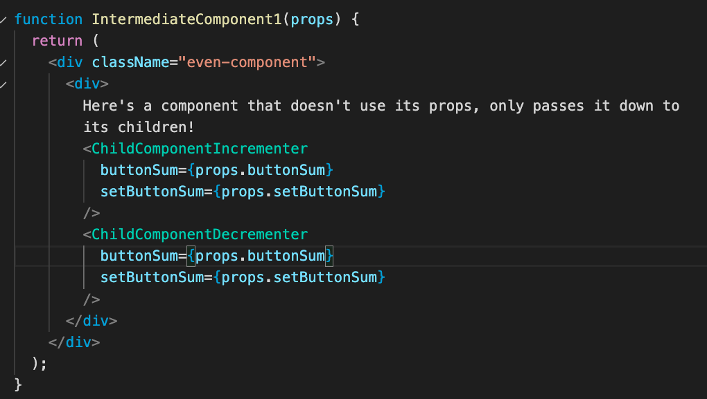
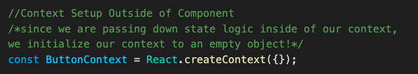
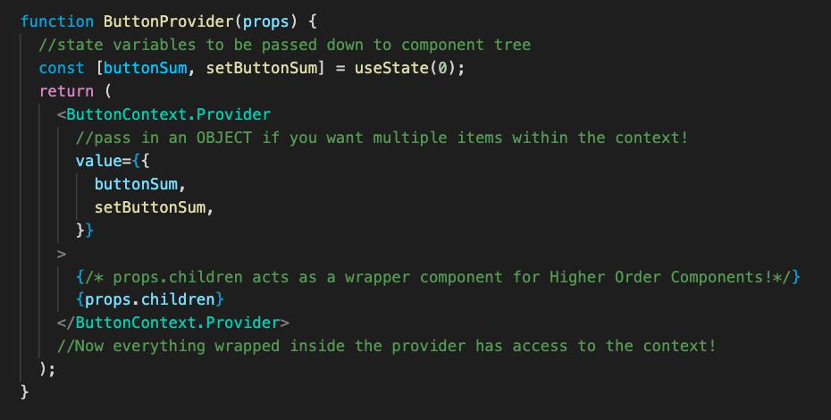
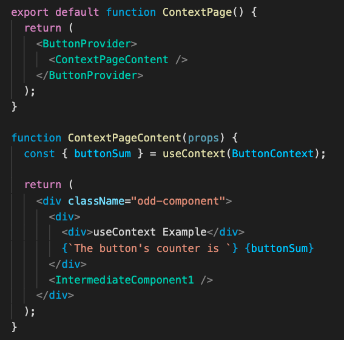
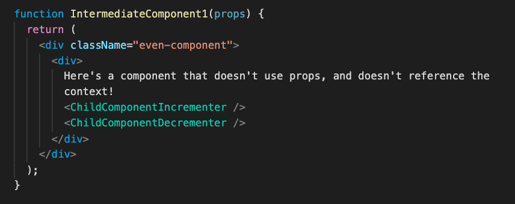
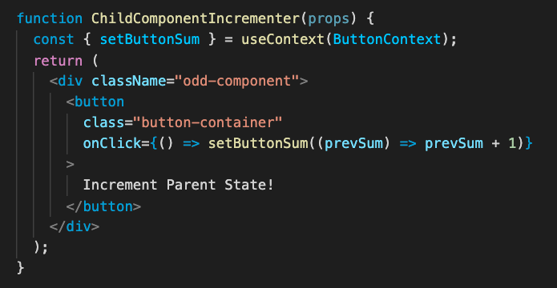

# TypeScript and React Hooks

Today we'll cover how TypeScript solves some of the problems with JavaScript, and some more React Hooks and tips that help us with

## Table of Contents

- [JavaScript To TypeScript](#javascript-to-typescript)
  - [Common Issues With JavaScript](#common-issues-with-javascript)
    - [Wrong Function Arguments](#wrong-function-arguments)
    - [Refactoring Struggles](#refactoring-struggles)
  - [What is TypeScript](#what-is-typescript)
  - [How Does TypeScript Work](#how-does-typescript-work)
  - [Getting Started With TypeScript](#getting-started-with-typescript)
  - [Typing](#typing)
  - [Interfaces](#interfaces)
- [TypeScript In React](#typescript-in-react)
  - [Typed Props](#typed-props)
  - [Enums](#enums)
- [React Hooks](#react-hooks)
- [useEffect and the React Lifecycle](#useEffect-and-the-react-lifecycle)
  - [Using the UseEffect Hook](#using-the-useeffect-hook)
- [useContext and Global State Management](#useContext-and-global-state-management)
- [Prop Drilling](#prop-drilling)
  - [Pros of Prop Drilling](#pros-of-prop-drilling)
  - [Cons of Prop Drilling](#cons-of-prop-drilling)
  - [How Do State Management Tools Solve the Problems?](#how-do-state-management-tools-solve-the-problems)
  - [Centralized State Logic](#centralized-state-logic)
- [useContext](#use-context)
  - [useContext setup](#usecontext-setup)
  - [Higher Order Components](#higher-order-components)
  - [Pros of React Context](#pros-of-react-context)
  - [Cons of React Context](#cons-of-react-context)
- [The React Router](#the-react-router)
- [Single Page Applications](#single-page-applications)
- [Plain HTML Websites](#plain-html-websites)
  - [Key Features of HTML Page Navigation](#key-features-of-html-page-navigation)
- [React Single Page Applications](#react-single-page-applications)
- [Webpack and Common Pitfalls](#webpack-and-common-pitfalls)
  - [Styled Components And CSS Modules](#styled-components-and-css-modules)
- [Emulating Multiple Pages In React](#emulating-multiple-pages-in-react)
- [React Router DOM](#react-router-dom)
  - [Routers](#routers)
    - [Links](#links)
    - [Switches](#switches)
  - [Passing Data Through URLs](#passing-data-through-urls)
    - [useParams Hook](#useparams-hook)
    - [Render Prop](#render-prop)
  - [Nested URL Parameters](#nested-url-parameters)
- [Router in Review](#router-in-review)
- [Conclusion](#conclusion)

## JavaScript To TypeScript

Developers have a love-hate relationship with JavaScript. Even though JavaScript is the [most commonly used language in the world](https://bootcamp.berkeley.edu/blog/most-in-demand-programming-languages/), it is only ranked #10 on the most loved languages according to StackOverflow's yearly developer survey while TypeScript is all the way up to #2!


**Why is that the case?**

## Common Issues With JavaScript

Since JavaScript is a dynamically typed language (which means that variables can change types), JavaScript fails to catch a lot of errors and makes refactoring code in the future hard.

### Wrong Function Arguments

Let's take a look at this function that divides two numbers!

```js
function divideTwoNums(a, b) {
  return a / b;
}
```

If we try running our code with two arguments that are both numbers, then the function works perfectly fine.

```js
console.log(divideTwoNums(8, 4));
//returns 2
```

However, if we try to pass in two arguments that are **_not_** numbers into `divideTwoNums`, we can see that some issues arise!

```js
console.log(divideTwoNums("apple", "banana"));
//returns NaN
```

**Should we be able to pass in "apple" and "banana" into our function `divideTwoNums`?
**

[TypeScript's Solution Here!](#typing)

### Refactoring Struggles

Let's take a look at a function that calls a pet argument we pass in!

```js
function callPet(pet) {
  return "Come here " + pet + "!";
}
```

We can call it like so:

```js
const myPet = "Rufus";
console.log(callPet(myPet));
//Prints out "Come here Rufus!"
```

However, let's say that we want to change the structure of our pet parameter for the function `callPet` to be a pet object like so:

```js
const newPet = {
  name: {
    first: "Rufus",
    last: "the Third",
  },
  type: "dog",
};
```

Even though our code editor won't spit any errors at us when we try running `callPet(newPet)`, the application **will** crash, but the error will point us towards the function instead of where the problem **really lies**, inside the function call.

```js
/*Our terminal tells us: TypeError: Cannot read property 'first' of undefined at callPet, even though our code editor thinks this is perfectly fine!  */
console.log(callPet(newPet));
```

This can be a **serious problem** since application crashes can be very costly for companies and we want to be able to detect our errors at the source!

[TypeScript's Solution Here!](#interfaces)

### What is TypeScript?

[TypeScript](https://www.typescriptlang.org) is an open-source language built on top of JavaScript that addresses the issues of JavaScript being a dynamically typed language by adding **static type definitions.** (types that are determined at compile time)


TypeScript is a **superset** of JavaScript which means that all JavaScript is valid TypeScript, but not all TypeScript is valid JavaScript.

### How Does TypeScript Work?


### [Compiled Vs Interpreted Languages](https://www.geeksforgeeks.org/difference-between-compiled-and-interpreted-language/)

While JavaScript is an **interpreted language**, which means that it gets read by an interpreter like a web-browser instead of compiled into machine code, TypeScript is a **compiled language** which means that TypeScript gets converted to JavaScript when you compile it, which offers a vast number of benefits!

- You can debug applications before they're being run, at compile-time.
- Your IDE can auto-fill properties of objects (with ctrl/cmd space).
- Compilation errors help reduce the chance of you making errors and help catch errors.

### Getting Started With TypeScript

Since TypeScript is built on-top of JavaScript, we're going to need to add it in our project's dependencies with:

```sh
$ yarn add typescript
```

This adds TypeScript support to our project and gives as access to the TypeScript compiler in our shell with `tsc` which we will use to run typescript commands like compiling our code and more!

To initialize TypeScript in our application, we have to run:

```sh
$ yarn tsc --init
```

This creates a `tsconfig.json` file in the root of our current directory and allows us to customize what we want TypeScript to allow or do.

When we compile/transpile our TypeScript code with:

```sh
$ yarn tsc path/to/file.ts
```

it checks for errors and gets transformed into JavaScript to the location of our `outDir` within our tsconfig.json .

The great thing about it is that it checks for type errors **before** we have to run the code and provides more thorough error messages which is amazing!

Now, let's go over some of the usages of TypeScript with some examples in small node scripts!

An In-Depth guide of learning TypeScript from JavaScript is also offered from the official typescriptlang website!

### Typing

Do you remember our [divideTwoNums function from earlier](#wrong-function-arguments)?

Even though it expected two numbers, we were allowed to pass in parameters that were **not** numbers which gave us unintended results!

However with TypeScript's typing denoted by the `:` symbol, we **have** to declare what are the types of return values of functions and the types of the function's arguments!

Let's take a look at the `divideTwoNums` function in JavaScript:

```js
function divideTwoNums(a, b) {
  return a / b;
}
```

If we were to type this in TypeScript, it would be like this:

```ts
function divideTwoNums(a: number, b: number): number {
  return a / b;
}
```

This means that the function's parameters, a and b are both numbers, and
the function `divideTwoNums` also returns a number!

When we compile with

```sh
$ yarn tsc tsTests.ts
```

it compiles to regular old JavaScript!

```js
function divideTwoNums(a, b) {
  return a / b;
}
```

This provides **type-safety** since we get compilation errors if we try calling `divideTwoNums` and a and b are not numbers!

```ts
/*Argument of type 'string' is not assignable to parameter of type 'number'*/
console.log(divideTwoNums("tree", "chocolate"));
```

### Interfaces

Do you remember our [`callPet` function](#refactoring-struggles) from earlier?

More than just simple typing of functions with primitives, TypeScript offers us a way to describe the **shape** of parameters and return values by providing an abstraction of the parameters we pass in!

Let's take a look at our `callPet` function in JavaScript again,

```js
function callPet(pet) {
  return "Come here " + pet.name.first + "!";
}
```

If we were to turn this into TypeScript, how do we know what is the type of the pet parameter?

TypeScript is a **duck-typed** language, which means that if it looks like a duck, acts like a duck, then it is a duck!

Duck-Typing is how **interfaces** are formed for TypeScript, and we can form them by looking at how we would want our parameters passed in as. Let's take a look at the pet object that we pass in.

```js
const newPet = {
  name: {
    first: "Rufus",
    last: "the Third",
  },
  type: "dog",
};
```

As we can see, the pet has a name object with a first and last field, as well as a type. To convert this to an interface, we essentially describe this `newPet` object in terms of its types!

```ts
interface Pet {
  name: {
    first: string;
    last: string;
  };
  type: string;
}
```

Now that we've declared that Pet objects have a name object with first and last fields of strings, as well as a type of string, we can pass in the interface as the type of `callPet`'s parameters!

```ts
function callPet(pet: Pet): string {
  return "Come here " + pet.name.first + "!";
}
```

We can also type our objects through our interfaces like so:

```ts
const newPet: Pet = {
  name: {
    first: "Rufus",
    last: "the Third",
  },
  type: "dog",
};
```

## TypeScript In React

You can also use TypeScript in React applications, but just make sure that if you use JSX elements anywhere that you label your files as `.tsx`!

### [Enums](https://www.typescriptlang.org/docs/handbook/enums.html)

Enums are a way to define named constants, and are especially useful in React components since you can make your props more descriptive, here's an example!

```tsx
enum Direction {
  Up = 1,
  Down,
  Left,
  Right,
}
function ParentComponent() {
  return <MyComponent direction={Direction.Up} />;
}
```

### Typed Props

Combining Enums and interfaces, we can ensure that we pass down props that we are expecting to our React code!

```tsx
enum Themes {
    DARK = 'dark',
    LIGHT = 'light',
    COLORFUL = 'colorful'
}
//this ensures that we only receive DARK, LIGHT, or COLORFUL as our props!
interface ClockProps {
    defaultTheme: Themes,
    startingTime: Date
}

function Clock(props: ClockProps){
    const [date, setDate] = useState(props.startingTime);
    return (
        <div class = "props.defaultTheme">
            It is {date.getDate()}
        </div>
    );
```

## React Hooks

Within React, we can use a lot more hooks other than useState, so let's take a look at other helpful hooks for React Development!

## UseEffect and the React Lifecycle

With React, one of its main benefits is how it only re-renders specific parts of a page at a time that **need** to be re-rendered.
The way that React knows which parts to re-render is through something called the React [Lifecycle](https://reactjs.org/docs/state-and-lifecycle.html).

- When a component first gets rendered, we say that it gets "**mounted**".
- Every time a component needs to get updated, either through its prop changing or internally its state changing, we say that it gets "**rerendered**".
- When a component leaves the screen, we say that it gets "**unmounted**".

Previously in class-based React, we had a whole slew of methods that hanlded the Component Lifecycle. However now, it's all handled in a neat and handy hook called **useEffect**.

### Using the useEffect Hook

Let's look at an example of how we can use useEffect to keep track of the lifecycle of our React components.

```js
useEffect(() => {
  console.log("componentDidMount");
}, []);

useEffect(() => {
  console.log("componentDidUpdate!");
  return () => {
    console.log("componentWillUnmount");
  };
});
```

Instead of worrying about the component lifecycle, useEffect just has you worry about two things. What do you want to do, and when do you trigger the effect? The useEffect hook takes in two arguments

1. A function that you call (can be an anonymous arrow function as well)
2. An optional dependency array that signifies when you want the Effect to run.

- If you do not list a dependency array, the effect will run everytime your component updates.
- If you pass in an empty array as the dependency array, the effect will only run when the component first mounts, similarly to componentDidMount.

```ts
useEffect(
  () => {
    //Function that runs whenever something inside the dependency array changes
    console.log("My effect is doing something!");

    //Optional return function that runs any cleanup as necessary (clearing an interval for example)
    return () => {
      console.log("Component is unmounting!");
    };
  },
  [
    /* optional dependency array*/
  ]
);
```

## useContext and Global State Management

Within React Apps, it can get messy trying to pass down props across multiple component trees. Right now, we'll talk about how the `useContext` hook can help to centralize state logic further and its pros and cons compared to "prop drilling" with React Components.

## Prop Drilling

**Prop Drilling is the practice of passing down logic that is used across multiple components within React Component trees.**


### Pros of Prop Drilling

- With prop drilling, you are explicit about which child components need logic, and make each child component simply a consumer of the state logic used up above in the parent component.

- The flow of code is **linear** which means the exchange of logic only goes one way: parent --> children


- When you use prop drilling, child components that use props passed down from the parent component don't listen to **ALL** state changes in the parent component and only change what they display accordingly when the props passed down to them change.

## Cons of Prop Drilling

- As you pass down props through more and more React components, it becomes harder and harder to add or remove logic from the "thread." In order to add or remove logic, you'll have to add or remove props through EVERY single component within the component tree. This can get annoying fast, and it can be easy to forget adding/removing props accordingly!
- If one component in the component tree doesn't rely on state logic of the parent but still has to pass it down to its children, the intermediary component receives props it will not use, in the concept called **over-forwarding props.**



- If you rename the props to something else, it gets very confusing which props correspond to state logic.

## How Do State Management Tools Solve the Problems?

Before React had state management tools built into the framework like `useContext` and `useReducer`, users had to rely on 3rd party state mangement tools like [React Redux](https://react-redux.js.org) or [Flux](https://facebook.github.io/flux/) to **centralize state logic.**

### Centralized Strate Logic

As discussed with prop drilling up above, having to "thread" your state logic across multiple components makes it cumbersome to remove or add props from the entire component tree, and is prone to user error of forgetting one here or there.

By centralizing state logic, we can achieve **global state** (only within the block scope, but we'll get to that later) which makes it easy to add and remove logic for an entire component tree.

Going back to the image above...


Centralized state logic allows us to provide _context_ for an entire component tree and make changes in one component be reflected across the entire tree.

Like we have discussed last week, the `useReducer` hook is a way to centralize state logic for a single state instance by handling complex state with different action types and payloads. This week, we will discuss how the `useContext` hook and `React.createContext` allows us to centralize state logic across an entire component tree, not just a singular instance.

## useContext

Similar to `useReducer`, context in React requires set-up both outside the component tree you wish to use it in and set-up inside the components as well.

### Context Set-Up Outside of Component Trees



First, you have to create a context object that will be passed down to components in its context. If it is a static value that will not change, you can initialize it to the value within the context object. Otherwise, if you want to pass down state logic to multiple components, you can pass in an empty object and add in the state logic later.



Once you have created a Context object, you must also create a Context Provider which will give the context to all "consumers" of the context. If your context is a static value, you can simply pass in its value in the `value` prop field. Otherwise, if you want to pass down state logic to consumers of the context, you must create a **Higher Order Component** which passes down state logic to its children through `ContextName.Provider`.

### Higher Order Components

A Higher Order Component, also called `FragmentContainers` in other state management tools, is a way to reduce rewriting code by creating a **template** for components that all rely on similar logic.

**EXAMPLE:** What if we wanted multiple components that all needed the same state variables? Making a template through HOC's help us centralize state logic in one place.

Inside HOC's with React Hooks, we can do everything we do with usual components like `useState`, `useEffect`, etc. and **provide** the logic to children components (through `props.children`)! In the future we'll discuss how other concepts in React like custom hooks help to reduce rewriting code as well.



Once you have created your Higher Order Component, simply wrap everything inside of it to give the context to everything within a component tree!

### Context Set-up Inside Component Trees

Unlike with prop-drilling, you do not have to write all your state logic that you want to keep track of inside of the parent component of the tree.
Instead, you can selectively choose parts of the context that you need by simply calling `useContext` with the context object.



You can only `useContext` if somewhere above in the component tree (either the component or one of its parent components) is wrapped inside of the `ContextName.Provider` HOC.



To use the context, simply destructure the value object of the context with the `useContext` hook, and pass in the `contextObject` to which your context provider is wrapped inside.

Let's take a look at how context and the concept of HOC can allow for the **separation of concerns** on a wider scale, which means that we can create components that handle state logic and create separate children components that are solely responsible for displaying content.

### Pros of React Context

- The concept of Higher Order Components allow for the separation of concerns (separate components for state, separate components for rendering)

- You avoid having to rewrite code if multiple component trees need the same logic

-Easier to add and remove state logic from component trees since it's centralized inside of the context object.

### Cons of React Context

- Whenever **anything** inside the context object changes, React forces a re-render of everything that depends on the context.
  (If within a component tree a component is wrapped inside a `Context.Provider`, that component and all its children will re-render with changes inside the context object.)

- Be careful when you `useContext`, don't slap it in everywhere! Be aware that it will force re-renders whenever context objects change, so `useContext` in cases where most/all components in a tree will be re-rendered anyways so that this is not an optimization concern.

- The separation of concerns delinearizes the flow of logic from parent->child since the child components can directly change logic within the context as well.


- More setup required than simply making state logic inside the parent component.

## The React Router

Now, we'll talk about some of React's internals with Single Page Applications, and how using external libraries for page navigation like [React-Router](https://reactrouter.com/web/guides/quick-start) is different than normal page navigation!

## Single Page Applications

Before we take a look at routing within React Applications, we should take a look how we would traverse across different pages in plain html/css websites vs React websites, and the differences between them!

### Plain HTML Websites

Looking at our [Day of Code](https://day-of-code-2021.netlify.app) for example, we can see how navigating between different html files works.

### Key Features of HTML Page Navigation

- Using links with the a tag, we can traverse to different pages of our application.
- Each separate file is its own webpage with distinct html and css files.
- We can use the same names for our css classes across different files.

### React Single Page Applications

However, with React applications, the way that navigation is set-up is slightly different!

Let's take a look at how a React web-site is set-up in the html and js file:

Within our index.html file...

```html
<body>
  <div id="root"></div>
</body>
```

And in our index.js file...

```tsx
ReactDOM.render(
  <React.StrictMode>
    <App />
  </React.StrictMode>,
  document.getElementById("root")
);
```

Even if we have a React Application with multiple pages, it's all self contained within a **single page**, and all our code gets combined into one giant webpage. This type of website is called a **Single Page Application**, and the main difference between this versus a Multi Page Application is that instead of fetching new pages whenever the user requests to move from one page to another, everything is contained within a **single** page. When requesting to view "another page", we simply load up one of the templates that the page can display instead!


React uses [webpack](https://webpack.js.org), a static module bundler for JavaScript applications which combines all of our css,js, tsx, and asset files all for our SPA. (Fun fact, all the webpack configuration gets set-up when we run `yarn create-react-app` (our template typescript starter has our own version of the setup instead of CRA :0 ) for us!) It adds all of our styles into the header of a **single file** for production, but that might lead to some issues...

### Webpack and Common Pitfalls

Since webpack combines all of our CSS styles into the header of our singular `index.html` file, there's a few things that we can't do in React that we can do in Multi Page Applications.

If you have multiple css files that contain the same class names, but are imported by different React pages/components, one will override the other and they will not retain their individual styles due to the webpack configuration for building our SPA.

**Example**: Let's say that we have two different pages that we want to represent, `FirstPage` and `SecondPage`. Each has their own css file, and if we define a shared class, `the-dress` separately between each css file, only one of them will actually be shown within our app and they will look the same!

**firstPage.css**

```css
.the-dress {
  /* our styling here */
  background-color: white;
  color: gold;
}
```

**secondPage.css**

```css
.the-dress {
    /* different styling for same class name! */
    background-color: blue;
    color: black'
}
```

And when we try using them within our application, even though we import separate css files, only one of the `the-dress` styles will show up between the two!

**firstPage.tsx**

```tsx
import React from "react";
import "./firstPage.css";

export default function FirstPage(): JSX.Element {
  return <div className="the-dress">This is my first page!</div>;
}
```

**secondPage.tsx**

```tsx
import React from "react";
import "./secondPage.css";

export default function SecondPage(): JSX.Element {
  return <div className="the-dress">This is my second page!</div>;
}
```

### Styled Components And CSS Modules

[Styled components](https://styled-components.com) offer a way to mitigate this by using **CSS-in-JS**, or you can also use [css-modules](https://github.com/css-modules/css-modules) to include multiple versions of the same className. I won't go in detail on them but you can read about them here! Webpack handles css modules for us, if we want to **locally scope** our css classes for specific modules, we just have to change our .css files to `.module.css` files!

### Emulating Multiple Pages In React

Even though React Apps are single page applications, we can emulate the usage of multiple pages through routing libraries like [`react-router-dom`](https://reactrouter.com/web/guides/quick-start) or [`reach-router`](https://reach.tech/router/). These two routing libraries are the most popular routing libraries for React applications. (In fact, they're actually combining together in the **very** near future and the merger has been in progress for the past two years!) Eventually, the best parts of each library will give us developers the best experience, but for today we will focus on the `react-router-dom` library!

## [React Router DOM](https://reactrouter.com/web/guides/quick-start)

React Router is a third-party router library that emulates multiple pages within a Single Page Application. First, let's go over how we can use it to change our URL and use it to showcase different things on the page!

### Routers

React Router offers a variety of Router types for us to use, but today we'll focus on the [`BrowserRouter`](https://reactrouter.com/web/api/BrowserRouter) that uses HTML5 history API to emulate page navigation just like in normal web applications, visiting previous "pages" with the forward/backward buttons in our browser! To use it, you can simply wrap your app with the `Router` of your choice.

```tsx
import React from "react";
import { BrowserRouter as Router, Switch, Route, Link } from "react-router-dom";

export default function App(): JSX.Element {
  return (
    <Router>
      <AppBody />
    </Router>
  );
}
```

The main way that we can navigate through pages is with Links and Switches!

### [Links](https://reactrouter.com/web/api/Link)

Just like how we can use `a` tags with `href` to navigate across different pages within regular web applications, we can use the `Link` feature within React Router to change the contents of our URL!

Under the hood, the Link tag works like the a tag, but simplifies the process a lot for us developers. To use it, we simply wrap the JSX component that we want to use to navigate across different URLs with the `Link` tag to change what shows up in our URL!

**CAUTION:** You can only use the link tag if somewhere higher up in the component tree (either the current component or one of its parent components) is wrapped within the `Router` tag.

Within our AppBody from up above... we can make a navbar that goes to different pages!

```tsx
<nav className="navbar">
  <div>
    <Link to="/">
      <button className="button-container">Base Page</button>
    </Link>
    <Link to="/first">
      <button className="button-container">First Page</button>
    </Link>

    <Link to="/second">
      <button className="button-container">Second Page</button>
    </Link>

    <Link to="/third">
      <button className="button-container">Third Page</button>
    </Link>
  </div>
</nav>
```

### [Switches](https://reactrouter.com/web/api/Switch)

Now that we've taken a look at how to change the content of our URL, how can we conditionally show different things on the screen depending on the URL? To do that, we use Switches and Routes to conditionally show things on the screen. Just like a switch statement, you only display the contents of **one** of the routes, depending on the current URL!

Further down in our appBody...

```tsx
<Switch>
  <Route exact path="/">
    Click a page on the top to get started!
  </Route>
  <Route path="/first">
    <div className="subcomponent-container">
      <FirstPage />
    </div>
  </Route>
  <Route path="/second">
    <div className="subcomponent-container">
      <SecondPage />
    </div>
  </Route>
  <Route path="/third">
    <div className="subcomponent-container">
      <ThirdPage />
    </div>
  </Route>
</Switch>
```

**CAUTION**: Within a Switch statement, it will automatically choose the first path that contains the path specified. If we removed the `exact` prop for our first Route, then none of the other routes would be displayed! To alleviate this, we can either move our landing page denoted by `"/"` to the bottom of the switch, or pass the `exact` prop to our landing page route.

### Passing Data Through URLs

The URL can be used for more than simply rendering different things on the page. Let's say we want to pass in some data from the URL into the webpage itself (this can be useful for user authentication, chatroom messages, and anything else we might want to store in the URL!). Within our Switch elements, we can use the **":"** identifier in our path to identify a variable that we will use within our children components of the switch!

**Example:** Here, we're going to display what's next in the url after the `/` and store it in a component!


If we take a look at how this is represented in the code, we can see how we pass in the parameter variable and give it the name `currentsection` inside our path.

```tsx
<Switch>
    <Route path = "/:currentSection">
        <Identifier/>
    </Route>
<Switch>
```

Then once we're inside the `Identifier` component that uses the data stored inside the URL, we can grab that data using either the custom
`useParams()` hook or the render prop that comes with React-Router. This offers us a way to pass down data across pages without even using React props! (We'll cover custom hooks later!)

### useParams Hook

Here's how we could use our useParams hook within our component:

```tsx
import { useParams } from "react-router-dom";

interface IdentifierParams {
  currentSection: string;
}

export default function Identifier() {
  let { currentSection } = useParams<IdentifierParams>();
  return (
    <div className="odd-component">
      The URL currently contains {currentSection}
    </div>
  );
}
```

**CAUTION:** when you pass down parameters this way, you will not get any "matches" for your Switch Routes if the URL is the empty base URL of **/**, since the route expects something after the **/** but nothing is there. To circumvent this, we can add in a special Route with the `path = "*"` property that acts as a 404 error handler if there are no routes matched.

A look at how it is in action!


### Render Prop

If you want the parent to handle the parameter logic and turn its child component to a **pure component** (one that doesn't depend on state logic/hooks, just props as data), you can use the render prop to handle it!

We'd change our route from

```tsx
<Switch>
    <Route path = "/:currentSection">
        <Identifier/>
    </Route>
<Switch>
```

to

```tsx
import { RouteComponentProps} from "react-router-dom";

<Switch>
    <Route
        path = "/:currentSection"
        render = {props : RouteComponentProps =>
       (
           //We have to get the matched path's parameters!
           <Identifier
                currentSection = {props.input.match.params.currentSection}
            />
       )
        }
    />
<Switch>
```

And we'd have to change our `Identifier` to:

```tsx
interface IdentifierProps {
  currentSection: string;
}

import { useParams } from "react-router-dom";

export default function Identifier(props: IdentifierProps) {
  //Using props, Identifier is a pure component with no side-effects!
  return (
    <div className="odd-component">
      The URL currently contains {props.currentSection}
    </div>
  );
}
```

### Nested URL Parameters

With our usage of parameter variables, we aren't limited to just one variable at a time. By separating different variables with the **":/"** separator we can pass in multiple parameter variables at once.

**Example:** Let's try taking a look at a page that takes in a random number 0-10 and a random number 11-20 whenever we move to that page.

With some string interpolation, we can pass the numbers into our URL within our `Link` tag.

```tsx
<Link to={`/random/${chooseNum10()}/${chooseNum20()}`}>
  <button className="button-container">Random Num</button>
</Link>
```

Our URL will be in the pattern of `/random/7/18`

When we parse the data of our URL within the `Route` of our `Switch`, we can do the same thing we did above of using the **":/"** separator to read in multiple variables, and name them whatever we want to.

```tsx
{
  /* First and second are URL parameter variables we are reading in!*/
}
<Route path="/random/:first/:second">
  <div className="subcomponent-container">
    <RandomNum />
  </div>
</Route>;
```

When using multiple parameters with our `useParams()` hook, we can grab it the same way as with one parameter, and selectively use parameters from our url (or pass down props through render prop instead).

```tsx
interface RandomNumParams {
  first: string;
  second: string;
}

export default function RandomNum(): JSX.Element {
  const { first, second } = useParams<RandomNumParams>();
  return (
    <div className="odd-component">
      This is the Random Nums Page!
      <div> The first number passed in is {first} </div>
      <div>The second number passed in is {second} </div>
    </div>
  );
}
```

As you can see here, we can change the number in the URL and pass it down **without** props!


## Router in Review

We've simply scratched the surface of everything that React-Router uses! Query parameters, history, recursive paths, and a ton more. So far, we've covered showing different components based off of parameters and passing information to children component through url parameters. Everything you need is in the [React Router documentation](https://reactrouter.com/web/guides/quick-start) and some things might be changing in the very near future when React and Reach router merge together :eyes:.

## Conclusion

Today, we've covered how TypeScript can solve a lot of JavaScript's problems, and we learned some more advanced React concepts that we can use in order to create some really cool websites! If you want to go in some more detail, ACM TeachLA covered a lot of these concepts that we've covered today in great detail within their [React Modules Playlist](https://www.youtube.com/playlist?list=PLPO7_kXilXFYvZaoYCTYC_KUkOYfmkOV1) and notes can be found within the [teachla-dev-training repository](https://github.com/uclaacm/teach-la-dev-training/tree/main/supplemental-react).
