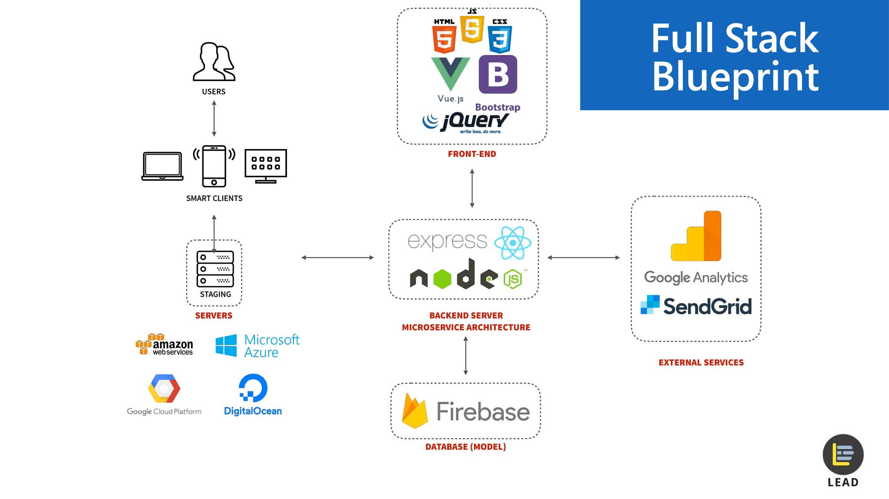

# Introduction to Backend

Today we will learn the basics of how to write a backend server in Javascript using the Express framework, including learning why you need a backend in the first place and how it works!

## Table of Contents

- [Overview](#high-level-overview-of-backends)
  - [Why Backend?](#why-do-we-need-backends)
  - [What do Backends do?](#what-do-backends-do-exactly)
- [Endpoints and Handlers](#endpoints-and-handlers)
  - [What are endpoints](#what-are-endpoints)
  - [What is a body?](#what-is-a-body)
  - [What is a handler?](#what-is-a-handler)
  - [How do I make an endpoint with a handler?](#so-how-do-i-make-an-endpoint-with-a-handler)
  - [How do I get data from an endpoint?](#how-do-i-get-data-from-an-endpoint)
- [Databases](#databases)
  - [SQL Databases](#sql-databases)
  - [SQL Query](#sql-query)
  - [NoSQL Databases](#nosql-databases)
- [Middleware](#middleware)
  - [Express Router](#express-router)
  - [More middleware examples](#more-middleware-examples)
- [Authentication](#authentication)
  - [DIY](#diy)
  - [SSO](#sso)
- [Conclusion](#conclusion)
- [References](#references)

## High Level Overview Of Backends

Today's workshop is about backend development. You don't need frontend experience, though having frontend experience will help you better understand some of the things we define in this workshop.

### Why Do We Need Backends?

A backend serves as a connection between the frontend, the database and external services that are used by a web app. It is responsible for the time-consuming processing of data or actions performed by the user. After completing the necessary processing, it returns the necessary information back to the frontend. Since the computationally demanding tasks were not performed on the frontend, the service is not reliant on user's on-device performance in order to perform critical tasks. In addition, backend's are frequently used for authentication or database serving, which may not be safe to do locally on a client's device.

### What Do Backends Do Exactly?

Here is a graphic from Google that helps illustrate this:

This is the typical structure of a fullstack web application. Let's ignore the left column for now.

First, we have a frontend that could be built in React, Angular, vanilla HTML/CSS/JS or any other framework tech stack. This is the interface that users interact with.

We then have a database that stores data that is required by the web app to function. We might also want to store and access data from some other services.

The backend in the middle serves as the support and glue between all the other components. The backend can be built using all sort of frameworks and technology, including Express.js (Node.js) and Flask/Django (Python). You can also build it in various other languages like Rust, PHP and Go! All it does is interface with the database (whether hosted locally or cloud-based), query APIs, and do any necessary computation before sending the required information to the frontend.

## Endpoints and Handlers

### What are endpoints?

**Endpoints** are network nodes that clients can connect to to perform certain actions or get some information from a backend server. They are the points of communication to and from the server. They are composed of two items: a **method** and a **URL**.

The method is the type of request that you are making to the server. There are several different methods, but the common ones are the following:

- `GET`: retrieves an item
- `POST`: creates an item
- `PUT`: update an item
- `DELETE`: delete an item

Secondly, the URL is the address at which you would like the clients to request the action. Think of it as the special command that tells the server what you want, in the form of a URL.

For example, `GET /users` could be an endpoint that responds with a list of users, and `POST /users/create` would create a new record of a user with the information included in the body of the request.

### What is a body?

In a HTTP request, there is a method, a URL, headers, and a body. The method and the URL together specify which endpoint the request is for. The headers specify information about the request, such as information about cookies. THe body is where data is placed to pass to an endpoint. It is particularly used for `POST` and `UPDATE requests that usually require form data.

There are different formats for the body. The most common is JSON.


### What is a handler?

A handler is simply the function that _handles_ the request send to the endpoint. It performs the action that is asked of the endpoint.

### So how do I make an endpoint with a handler?

Typically in any framework, you would need to first specify the handler, and then register the handler with a particular endpoints.

Specifying a handler requires you to define a function that performs the action. Suppose that we want to have an endpoint that returns hello at the URl `/hello`. In express, the code to create this endpoint would look something like this:

```js
const express = require("express");
const app = express();
const port = 8081;

app.get("/hello", (req, res) => {
  res.status(200).send("Hello!");
});

app.listen(port, () => {
  console.log(`Example app listening on port ${port}`);
});
```

Here, the function `app.get()` is supplied the url for the endpoint we want and the handler function for the endpoint. If you were to run this on your computer by running the command `node app.js` (replace `app.js` with the name of your file) and go to your browser and try to access `localhost:8081/hello`, you would see the text "Hello".

The handler function takes in the request and response objects as its argument, and returns a status code 200 and the string "Hello!". The response code 200 means there is no error. There are other error codes that can mean other things. In fact, lets create an endpoint that it reached whenever there is an invalid URL. In this case we want to return the status code 404, which you might remember being the error code for not found.

```js
app.use((req, res) => {
  res.status(404).send("Endpoint does not exist");
});
```

And that's it! That's endpoints and handlers at their bare bones.

However, this is rather boring. What if we want to request a hello for a specific person? Or update some information? That's where path parameters, query parameters, and form data comes in.

Path parameters are variable parts of a URL. These can be stored and later used to access specific information.

For instance, we can have the endpoint `GET /users/:id`. The colon specifies that the part after `/users` is a path parameter. Anything put after /users is saved into a variable called `id`. So the request `GET /users/joebruin` would result in `joebruin` being saved to `id`. Note that if you try to request `GET /users/joebruin/goodbye`, you are requesting a different endpoint. This is because `/` is a special character and any instance of it sections the URL.

To see how the request parameters are stored and can be accessed in the handler function, we access the params property of the request object as shown below:

```js
app.get('/users/:id', (req, res) => {
	res.status(200).send(req.params)
}
```

Path parameters and query parameters are generally used for GET and DELETE requests.

If you were to access a URL in the form `/users/*`, where the `*` could be any data, you would see a javascript object that maps the key id to the value `*` you entered.

Query parameters are when you have ? after an endpoint URL followed by the pattern field1=value1&field2=value2&field3=value3 where there can be any number of pairs of fields and values. This type of endpoints get parsed as a map of the fields to values. The URL /users?name=joebruin would correspond to requesting data at the endpoint /users and with the query parameters as "name: joebruin", where joebruin can be any name.

An example endpoint that uses query parameters is shown below:

```js
app.get("/query", (req, res) => {
  let param1 = req.query.param1;
  let param2 = req.query.param2;
  res
    .status(200)
    .send(`You input param1 to be ${param1} and param2 to be ${param2}`);
});
```

Form data is generally used for POST and UPDATE requests, where a lot of data is expected. Form data is stored in the body.

### How do I get data from an endpoint?

The following code shows how to get data from an api endpoint in node. You should not that using the fetch function directly in a Javascript file requires you to install `node-fetch` and import `fetch` from `node-fetch`. You will not need to do this if you are working directly in a react app.

```js
import fetch from "node-fetch"

const url = 'http://localhost:8081/json'

fetch(url, {
	'Content-Type': 'application/json'
})
	.then(response => response.json())
	.then(data => console.log(data))

async function fetchData(url) {
	const response = await fetch(url, {
		'Content-Type': 'application/json'
	})
	const data = await response.json()
	return data
}

const data = await fetchData(url)
```

The `fetch` function used above takes in the URL of an API endpoint and request headers as arguments. In the above example, the `Content-Type` request header has been set. There are two examples of data fetching. One of them uses promise chaining and the other uses async await. Both methods produce equivalent results. The fetch call returns a response object which can be destructured to get the `json` returned and the status.

## Databases

### SQL Databases

SQL (Structured Query Language) databases are characterized by being structured in tables. Every row in the table represents an entry of data, organized by the columns.


Each column can have different types, such as integer, string, float, date, etc. However, everything in one particular column must have the specified type. They also don't have a map or dictionary type. To get that same effect, you can serialize the map into a string, as seen in the "attributes" and deserialize once you retrieve the data.

### SQL Query

To retrieve, add, modify, or delete information from SQL databases, you perform SQL queries. These can be performed in the console connected to the databases.

Here's an example of a basic query retrieving some data from our table above.

```sql
SELECT * FROM fruits
WHERE quantity < 5;
```

This query asks for all entries in the `fruits` table where the `quantity` field is less than 5. It asks for all the columns that these rows have. To query for only certain columns of the rows:

```sql
SELECT name, price FROM fruits
WHERE quantity < 5;
```

You can learn more about SQL queries [here](https://www.w3schools.com/sql/).

### NoSQL Databases

NoSQL databases are structured into documents. Each document is similar to a JSON object, where you have a set of fields and values. A document can have missing fields, but each document in a collection must have the specified value type for a particular field.

The values could be of different types like integer, string, dates, etc. They can also be maps!. As such, NoSQL allow for much more flexibility.
For the same data that is in the table above, we can store them in NoSQL as such:

```json
{
    "id": 1,
    "name": "apple",
    "quantity": 5,
    "price": 4.00,
    "attributes": {
        "seasonal": false,
        "color": "red"
    }
}
{
    "id": 2,
    "name": "banana",
    "quantity": 7,
    "price": 5.30,
    "attributes": {
        "seasonal": true,
        "rotten": true
    }
}
{
    "id": 3,
    "name": "cantaloupe",
    "quantity": 9,
    "price": 10.00,
}
```

Notice how for attributes, we're storing a map and how we can have different fields in it. Furthermore, the last document doesn't have attributes at all.

You can play around with NoSQL [here](https://www.mongodb.com/nosql-explained).

Choosing what type of database to use depends on your use case and what is required.

## Middleware

It is good software practice to compartmentalize your code and to avoid code wastage. Express middleware are functions that execute during the lifecycle of a request to the Express server. Each middleware has access to the HTTP request and response for each route (or path) it's attached to. You can chain middleware together to compartmentalize and reuse code.

### Express Router

Express provides a Router class that allows us to create modular route handlers. A Router instance serves as an example of middleware. The best way to demonstrate a router is with an example. We first create a new file called `birds.js` with the following content.

```js
const express = require("express");
const router = express.Router();

router.get("/", (req, res) => {
  res.status(200).send("Birds homepage");
});

router.get("/about", (req, res) => {
  res.status(200).send("About birds");
});

router.use((req, res) => {
  res.status(404).send("No birds were found here!");
});

module.exports = router;
```

This code sets up a router as a module and defines some routes. We now need to mount the router module on a path in the main app. To do this we go back to the entry point of our express app and add the following code.

```js
var birds = require('./birds)

// ...

app.use('/birds', birds)
```

Our app is now able to handle requests to `/birds` and `/birds/about` and list our customized error message for URLs that start with `/birds`.

### More middleware examples

We will now demonstrate middleware that runs at the beginning of every API call. Before the definition of other endpoints in our main express file, we can define a function that runs before any of the other handler functions. To do this, we add a call to `server.use` without specifying a route. An example of this is shown below.

```js
server.use((req, res, next) => {
  // Things to be done for all requests
  next();
});
```

It is important to note a few things here. First, middleware should be defined before the endpoints you want it to be used for. Secondly, the function passed into this endpoint takes in a function `next` as a parameter. The function `next` is a function in Express router which executes the middleware succeeding the current middleware. In our case, it would move on the API endpoint the request for intended for. Thirdly, We observer a similar call to `app.use()` for when we want to indicate the user has tried to reach and endpoint does not exist. Here, the relative position of the call to `server.use()` makes a difference, since our middleware being before the other endpoints means it will be called before them, while the code that returns a 404 error happens after all the code and there will only be run if none of them are reached of fail to return a response. You can check and see that you receive a 404 error in the case where you replace returning a response with a call to `next()`.

## Authentication

We will now briefly explore the different ways of implementation authentication. There are a couple fo different approaches to implement authentication. You can keep track of the user's password and the verification process yourself or let a 3rd party take care of it for you.

### DIY

To implement your own authentication, you need a users table/collection (I'll refer to it as just a table, even though you can use collections as well) in your database. It should have at the bare minimum an email field or some sort of unique identification for the account and password field. Then, you would have a `POST` request to an endpoint to create a user, with a handler to add a new entry to the users table, and a `POST` request to another endpoint to login a user, with a handler to query the table for a user with the expected email and to check that the password is correct.

However, you should not store the raw password. Instead, the password should be encrypted in the database. This way, you're not exposing the password during transmission and storage. You should use a 3rd party library to deal with the encryption and checking since oyu will most definitely not implement it correctly by yourself.

Secondly, we need a sessions table ot store whether or not the user is logged in. A session is a hash that contains information about who is logged in and other such metadata. On the frontend, the session would be stored as a cookie on the browser. This would allow the session to be remembered across different pages. Whenever the frontend makes a request to an endpoint that requires the user to be logged in, the session cookie is passed to the backend. The backend can then check if the session exists in the session table. This checking can be easily implemented for multiple endpoints by checking for user authorization in express middleware. If the user is logged in, it can return the information the user desires.

There are other ways of implementing login yourself, such as by using JWT tokens. You can learn more about this method of authentication and authorization [here](https://jwt.io/introduction).

### SSO

These days, you often see "Sign in with \_\_" on websites. THese sites use Single=Sign On (SSO) to associate users with data. They let 3rd parties deal with authentication and only take care of the data.

To achieve this, the general approach is to evoke the appropriate API call from the 3rd party on the frontend to trigger the Sign in pop up from the 3rd party. The 3rd party will then return a token and a profile ID. The profile ID is the assigned ID to the user account by the 3rd party. The token is a string that marks if the user is signed in. It's not exactly the same thing as a session, but it is similar.

On the backend, whenever a user should be signed in, you'd check using the token and the 3rd party's API to see if the user is signed in. You can associate the profile ID givenw itht he data you want to store, as usual. SSO makes implementing authentication a lot easier since you don't have to deal with sessions or storing passwords.

## Conclusion

Today we learned the basic principles of backend, and how to use express to build middleware and routing!

This is the last workshop in our training for this year, and committees will have more specific training should you need any. We hope you had fun and learned some cool web dev!

## References

- [TeachLA Intro to Backend](https://github.com/uclaacm/teach-la-dev-training/tree/main/backend)
- [Express JS Documentation](https://expressjs.com/en/guide/routing.html)
