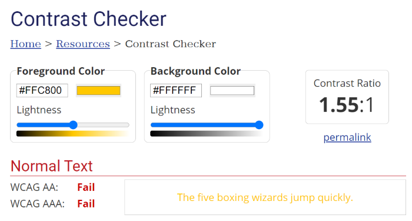

# Web Accessibility

Welcome to an introduction to accessibility on the web! After this workshop, you should have a basic understanding of what kinds of needs we should be meeting as web developers. You should be able to evaluate websites using your familiarity with accessibility guidelines, with the help of convenient tools.

## Table of Contents

- [Why Accessibility?](#why-accessibility)
- [Appearance](#appearance)
    - [Fonts and Font Size](#fonts-and-font-size)
    - [Line Height](#line-height)
    - [Zoom Levels](#zoom-levels)
    - [Color Contrast](#color-contrast)
        - [WCAG](#wcag)
- [Supporting Screenreaders](#supporting-screenreaders)
    - [Alt Text](#alt-text)
    - [Transcripts](#transcripts)
    - [Semantic HTML](#semantic-html)
    - [Aria Labels](#aria-labels)
- [Movement](#movement)
    - [Reduced Motion](#reduced-motion)
    - [Autoplay](#autoplay)
    - [Animation](#animation)
- [Focus Control](#focus-control)
    - [Keyboard Accessibility](#keyboard-accessibility)
    - [Tabbing](#tabbing)
- [Other Things](#other-things)
    - [Simplicity](#simplicity)
    - [Setting Language](#setting-language)
    - [Setting Title](#setting-title)
- [Tools](#tools)
    - [Accessibility Subtabs](#accessibility-subtabs)
    - [Lighthouse Monitor](#lighthouse-monitor)
    - [Screen Readers](#screen-readers)
    - [Automated Checkers](#automated-checkers)    
- [What's Next?](#whats-next)
- [Conclusion](#conclusion)
- [References](#references)

## Why Accessibility?

To create the best user experience, we should be comfortable with constantly adapting to the most recent accessibility standards. (This tends to be a theme across computer programming.)

For many, poor accessibility features are an inconvenience at worst or even unnoticeable at best. But for an equally important population, these features can make or break their experience with your website.

These users experience a range of needs, including colorblindness, use of a screenreader (for people with visual impairments, people with learning disabilities, etc.), poor vision (for the elderly, people with visual impairments, etc.), susceptibility to seizures, and more.

Why is this so important, you ask?
1. Make websites functional and enjoyable for users with different needs
2. Everyone benefits from accessible websites
3. Increase traffic and user satisfaction

Each website element that you design or create will be used by all kinds of different people. So, we need to think about how these parts can meet the needs of our users. Many web developers (like me) can get too caught up in what looks "cool" and not what is actually legible or usable.

Good web design, like any kind of design, is a balance of both aesthetic and function. Web accessibility should be an integral part of web design, and not something that is considered "optional", since by keeping tech inaccessible you only allow a subset of the population to really access it.

## Appearance

Let's start with the visual appearance of websites, since most of us are probably already familiar with the qualities that make a website visually accessible or inaccessible.

### Fonts and Font Size

Have you ever visited a website with an uncomfortably small or weirdly large font? Pretty annoying, right? Fortunately, someone was smart enough to come up with standard font sizes for mobile and desktop. 

```css
/* CSS file */
/* 768px is a common breakpoint for smartphones */
  @media all and (max-width: 768px) {
    html {
     font-size: 16px;
    }
  }

  @media all and (min-width: 769px) {
    html {
     font-size: 18px;
    }
  }
```
Fonts can still look too small or too large at these sizes, so adjust as needed.

Mini typography lesson: serif fonts like Times New Roman are often used in body text, because serifs aid the eye in reading text (Serifs are the little hooks on the ends of letters). Sans serif fonts like Arial are also popular because they look sleek and modern.

We stick to basic serif and sans serif fonts because using display (aka fancy) fonts in body text slows down the brain's processing of text.

A good rule of thumb is to copy a paragraph of a random article into your chosen font, and see if you can easily scan the paragraph. If not, it's probably not a good choice for your website.

### Line Height

A short note on line height: closely packed paragraphs of text can be really awful to read! The standard for paragraph text (as opposed to headings and other text) says that we should have a line height at least 1.5x as large as our font size.

```css
/* CSS file */
  body {
    font-size: 16px;
    line-height: 24px;
  }
```

### Zoom Levels

Users with visual impairments, such as the elderly, often need to zoom in on 16px or 18px text in order to be able to read clearly. As you're developing your website, try zooming in up to 200% and see if the website is still usable. If elements are jumping around or hiding text at this zoom level, that's bad news.

Be careful when using `position: absolute` and other fixed position values because they can result in some unintentional effects in different screen sizes and zoom levels. Using flexbox and other automatic layouts can help prevent this.

Horizontal scrolling should be avoided because users always expect vertical scrolling. One way horizontal scrolling can unintentionally happen is if our text isn't wrapping correctly inside a container. `whitespace: normal` should be the default, but if things are looking funky, try explicitly setting this property.

```css
/* CSS file */
p {
  white-space: nowrap;
}
```


```css
/* CSS file */
p {
  white-space: normal;
}
```


### Color Contrast

Color blindness affects 1 in 12 men and 1 in 200 women worldwide. For these people, as well as people with low vision, it can be hard to read text against a noncontrasting background.

What does color contrast mean, exactly?

Technically, there are three types of contrast: hue, luminance, and saturation. The difference between the three can be found in any Adobe Photoshop properties panel:


What we're mainly addressing here is luminance contrast, since high hue contrast doesn't help if luminance contrast is still low. To illustrate, take the following example of green text on a red background. Even though red and green have very different hues, you can see that the end result is pretty unpleasant.


What's up with the second image? That's what would happen if you sucked all the color out of the red and the green. This desaturated example shows why the first image was so ugly: it's because the two colors are too similar in luminance! That's what makes noncontrasting colors hard to read.

**Important: these examples are for illustrative purposes and are an oversimplification of color blindness.** When talking about tools, we'll look at how you can use the built in Chrome and Firefox accessibility tools to simulate color blindness on websites.

In the real world, bad color contrast can be hard to spot. Thankfully, you don't have to calculate any ratios yourself. Color-contrast checkers like [WebAIM's checker](https://webaim.org/resources/contrastchecker/) help us make sure that our text and visual elements pass standards.



Sometimes we'll be tempted to place text over images. It's very difficult to make sure that each of the different color combinations in these instances pass standards! So it's best to avoid background images when the text is essential to understanding or using the site.

Large text literally has larger shapes, which makes it slightly easier to see/read. In the color contrast checker image, you can see that large text has slightly more lax standards. If you must place text over images, larger text is a better way to go.


#### WCAG

WCAG stands for the Web Content Accessibility Guidelines. For example, in the contrast checker screenshot above - you see two `Fail`'s for WCAG AA and WCAG AAA.
You can find the WCAG standards [here](https://www.w3.org/WAI/standards-guidelines/wcag/)

Currently, the WCAG standards in use are WCAG 2, and WCAG 3 is a work in progress. WCAG 2 has three levels of conformance, A being the lowest, AA being mid range (and the one that most websites aim for), and AAA being the highest.

From the WCAG 2 website:

The WCAG documents explain how to make web content more accessible to people with disabilities. Web “content” generally refers to the information in a web page or web application, including:
- natural information such as text, images, and sounds
- code or markup that defines structure, presentation, etc.

## Supporting Screenreaders

### Alt Text

You've seen alt text before, which is displayed when an image file fails to load. It's also read by screenreaders.

Always provide alt text for images that have semantic meaning. For example: a decorative background image of a stripe pattern probably does not need alt text, but an illustrative image of the company's logo probably does.

A good rule of thumb is if the image adds context to the page that isn't already present in surrounding text, then alt text is needed. If nothing new is added, then `alt=""` is okay.

Why can't we just omit the `alt` attribute? In the absence of alt text, screenreaders may attempt to read the file name instead.

```html
<!-- HTML file -->
 
```


Writing good alt text takes a little thought. Think of it as similar to a caption, only as brief as possible. For example, do not write "Image of..." or "Graphic of..." since it's usually obvious what the element is. However, "Painting of..." may be used since the user would not know this if the image had failed to load. Alt text is meant to describe functionality of the image, not just the visual result of looking at it.

Be accurate when describing image content&mdash;we shouldn't provide information that is not present in the media.

Alt text for icons follows the same conventions as for images, since some icons (such as file-type icons) add context.

The only situation where alt text can be redundant with surrounding text is when an image functions as a link. In that case, alt text must be present to act as a link, so `alt=""` is not allowed.

Videos do not support `alt` attributes. Use `title` instead or provide an external link to the video.

Finally, **CSS does not support alt text**. When using `background-image` and other CSS image-related properties, use decorative images only, since there's no way a screenreader can "see" the image.

In summary, when writing alt text, we should ask ourselves:

1. Does this image/icon add context (or does it function as a link)?
2. Is my alt text as brief as possible?
3. Does my alt text accurately and fully describe the image and the purpose of having the image on the webpage?

### Transcripts

English language learners and people with hearing impairments can have difficulty following audio or video elements. Transcripts and subtitles are also useful in noisy environments or when skipping through media to find specific information.

WebVTT files are the standard for closed captions. We can include these with the `track` tag, and specify `kind = subtitle` and `label` using the appropriate language.

`srclang` uses a language code to specify the type of data used <span tabindex="-1">(see [Setting Language](#setting-language)</span>), while `label` is meant to help the user choose the correct subtitles.

Include the `controls` attribute to allow access to volume controls, video pause and playback, existing subtitles and transcripts, and more.

```html
<!-- HTML file -->
<video controls width="500">
  <source src="resources/video.mp4" type="video/mp4" />
  <track src="resources/english.vtt" kind="subtitles" srclang="en" label="English" />
  <track src="resources/spanish.vtt" kind="subtitles" srclang="sp" label="Spanish" />
</video>
```

### Semantic HTML

### Aria Labels

## Movement

### Reduced Motion

### Autoplay

Autoplay can be disorienting for users, as well as annoying (have you ever tried to find that one tab that randomly starts playing music? Yeah).

The `autoplay` attribute for `video` tags is an "opt-in" feature. This means that the existence of the attribute alone enables autoplay. If for some reason this attribute is present in your code, you have to delete it in order to disable autoplay. Setting `autoplay=false` will not work.

Similarly, allow users to pause and navigate slideshows—it can be distracting to see a constantly sliding slideshow when you're trying to focus on a different part of the page. Plus, many slideshows move too fast for some users to read each slide.

### Animation

Many people are prone to seizures and can be harmed by websites with too much animation. This means limiting the number of GIFs, and avoiding flashing elements at all costs (the WCAG 2.1 standard is three flashes or less per second).

## Focus Control

### Keyboard Accessibility

### Tabbing

## Other Things

### Simplicity

Simplicity is an important factor for web accessibility. Making sure language is general so everyone understands what you're saying, using direct links instead of unnecessary icons, and so on. As we said in the introduction - good web design, like any kind of design, is a balance of both aesthetic and function. While we do want our websites to look pretty and cool, it's important to avoid overwhelming our users with information or fancy representations of things that could've been simpler and easier to process.

### Setting Language

Screenreaders are preprogrammed voices that read page content for users. Bad pronunciation can happen when it doesn't know what language a website is written in (by language I mean human language, not programming language). We can help out by specifying each page's main language using the appropriate language code:

```html
<!-- HTML file -->
<html lang="en">
  <!-- Your website goes here -->
</html>
```

### Setting Title

Set the document `<title>` to correctly describe the current page content as this ensures that the user remains aware of the current page context:

[WCAG - Understanding the Document Title Requirement](https://www.w3.org/TR/UNDERSTANDING-WCAG20/navigation-mechanisms-title.html)

In React, this can be set using the [React Document Title Component](https://github.com/gaearon/react-document-title)

## Tools
### Accessibility Subtabs
### Lighthouse Monitor
### Screen Readers
### Automated Checkers

## What's Next?

## Conclusion

## References

- [TeachLA Accessibility on the Web](https://github.com/uclaacm/learning-lab-crash-course-su20/tree/main/13-accessibility)
- [React docs on Accessibility](https://reactjs.org/docs/accessibility.html)
