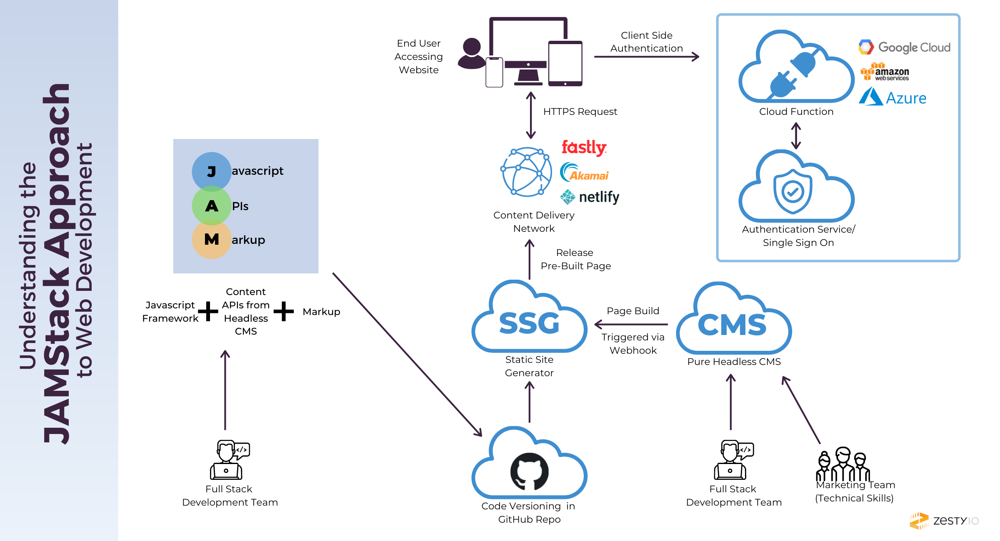
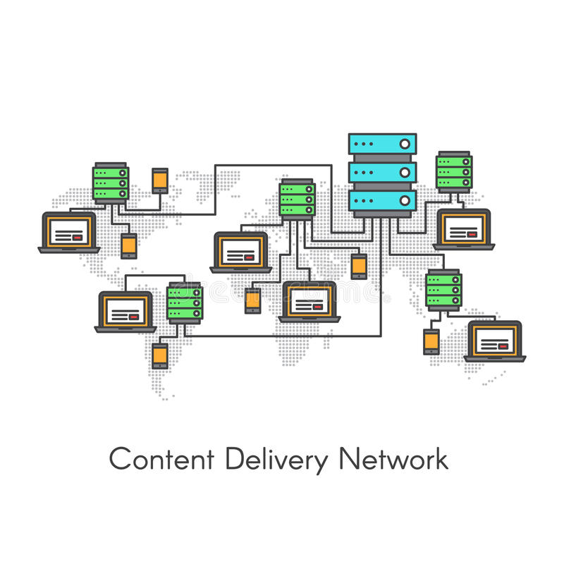
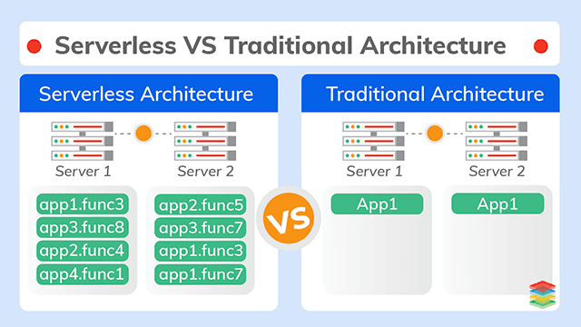
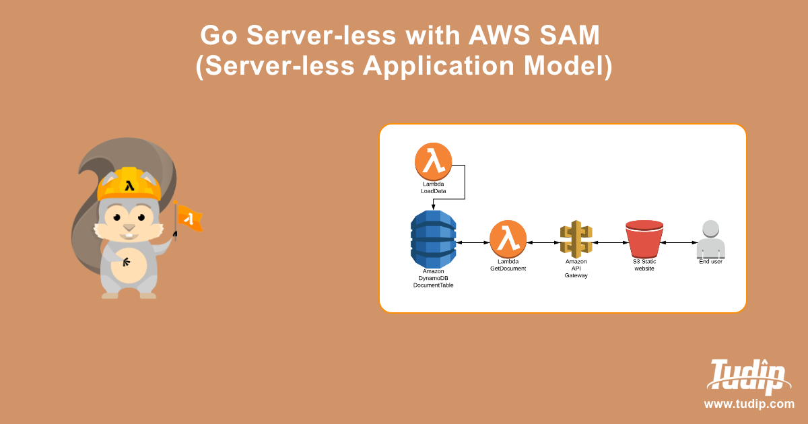
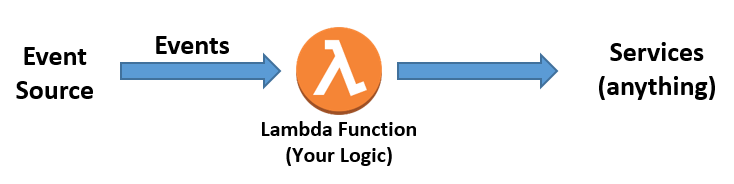

# Deployment And Integration

Last quarter we covered a bit about continuous integration and deployment with regards to working on projects! However today, we'll cover in a bit more depth the cloud deployment tools that are used internally within ACM and how we can set-up Continuous Integration/Deployment Pipelines!

## Table of Contents

- [Frontend Deployment](#frontend-deployment)
  - [The Jam Stack](#the-jam-stack)
  - [CDNs](#cdns)
  - [Netlify](#netlify)
- [Back End Deployment](#back-end-deployment)
  - [Server Vs Serverless Architecture](#server-vs-serverless-architecture)
  - [Server Deployment](#server-deployment)
    - [Heroku](#heroku)
  - [Cloud Functions](#cloud-functions)
- [Machine Independence](#machine-independence)
  - [Docker](#docker)
  - [Deployment From Github](#deployment-from-github)
- [Continuous Integration](#continuous-integration)
- [Monorepositories Vs Separate Repositories](#monorepositories-vs-separate-repositories)
  - [CORS Issues](#cors-issues)
- [Conclusion](#conclusion)
- [References](#references)

## Frontend Deployment

Last quarter, we saw how easy it was to deploy static websites on Github Pages by simply adding GitHub pages to your repository! When deploying websites, there is a popular architecture being used nowadays to showcase your project to the world, and today we'll talk about the **Jam Stack**.

### The Jam Stack

The [Jam Stack](https://jamstack.wtf/) stands for

- **J** JavaScript For Interactivity
- **A** APIs for dynamic data retrieval/requests
- **M** Markup with Static HTML Files



(API stands for application programming interface, and is a way for different programs to communicate amongst each other!)

While that is what JAM Stack originally stood for, it's more broadly used now to define an architecture for building websites:

- Decoupling The Front and Backend, where the front-end simply makes API requests to a back-end deployed separately, and does as little processing as possible on the front-end.
- Thinking of performance first by pre-rendering HTML and CSS for faster [first contentful paint](https://developer.mozilla.org/en-US/docs/Glossary/First_contentful_paint) (which means that the user knows that the page is loading!)

### CDNs

More on the topic of performance and speed, CDNs or Content Delivery Networks, are how modern-day JAM Stack architecture ensures speed of deploying your website. CDNs essentially are a distributed system that plops down your website content in separate server locations throughout the world, ensuring that clients only have to communicate with the server that will give them the most optimal load time and taking the load off of a single centralized server.



### Netlify

[Netlify](https://www.netlify.com/) is one of the most popular tools used to deploy JAM Stack websites, and it makes deploying your front-ends easy with the simple click of a button!

By connecting your repository to Netlify, it's easier than ever to get a URL to your website, and deploy websites that abide by [JamStack](#the-jam-stack) rules!

However, some projects can't simply use APIs and need their own backends as well, and we can't use Netlify to deploy them!

## Back End Deployment

The JAM Stack excels for front-end architecture, but cannot be used if you want to deploy a project which utilizes a backend! Server-side code contains logic that can't be explicitly shown to the user, and thus can't be cached by a CDN, and thus requires compute time. There are actually two ways that you can deploy backends for your projects, the traditional way with a server, or server-less through cloud functions. We'll cover both and see the benefits/drawbacks of each!

### Server Vs Serverless Architecture

Prior to the mid 2010s, the main way that one deployed backends was with a dedicated back-end server!


However, starting recently, the usage of cloud functions and server-less architecture has grown more popular across cloud service providers with the growth of services like Amazon Lambda Functions, Google Cloud Functions, etc.

Let's see traditional server deployment first!

### Server Deployment

By deploying your backends to cloud provider services like AWS EC2, Heroku Dynos, etc, they handle having your backend ready for incoming requests, with a metric called [server uptime](https://www.kaseya.com/blog/2020/10/08/server-uptime-monitoring/#:~:text=Server%20uptime%20is%20the%20total,measured%20by%20server%20monitoring%20tools.).

Compared to serverless computing like shown below: traditional servers have a few advantages and disatvantages:

| PROS                                            | CONS                                 |
| ----------------------------------------------- | ------------------------------------ |
| Easier Debugging as you handle all server logic | Increased Cost                       |
| Increased Security                              | More Overhead Management/Maintanence |

As stated in the JAM Stack section, backend servers are normally decoupled from front-ends because they take time to warm-up and get online. Backend servers excel in good uptime and constant availability, but that comes at the cost of the upkeep necessary to keep a server running. A more modern approach that addresses the issue of the upkeep cost necessary to keep a server running is through using serverless architecture and cloud functions!

### Heroku

Heroku is one of the great tools that we can use to deploy backends! At its core, Heroku uses [dynos](https://www.heroku.com/dynos) which are virtualized linux containers that execute user commands and optimize server uptime!

Deploying to Heroku is almost as simple as deploying via Netlify! All you have to do is add an extra `Procfile` which describes to Heroku how you want the Dyno to spin up your application. Let's look at an example Procfile and break down what it does!

```Procfile
web: node app.js
```

Heroku commaads are broken down like: <process type>: <command> , and this tells us that we want to open up a web-server that takes in incoming http requests, and when it does, we want to start our `app.js` file to keep our server up!

### Cloud Functions

If backend servers are used to decouple the front-end and back-end of your project, cloud functions and serverless architecture take it one step further and separate out different tasks of your backend into different **event handlers** and has the cloud provider handling the storage/resources necessary to handle each request.



Instead of a single server handling all of your requests, you distribute all of your backend's logic across different event handlers that fire off when you want to.



Serverless computing has gotten **very** popular in the last couple of years due to a couple of key factors:

- The cloud provider handles all the infrastructure needed for your servicem and distribution of tasks is done through a decentralized serverless model.
- Reduced upkeep cost due to only triggering certain functions when necessary
- Event driven models require less maintenance as the logic behind each request is encapsulated in each handler.

Overall, these models both have their pros and cons, but as serverless computing advances, it seems as though it might be the future of project development as we know it!

## Machine Independence

With cloud deployment, it's important to note that it is **not the version on your local machine** that is the version that is being deployed, it is the cloud provider of your choice doing so. To avoid issues like "it worked on my machine, why doesn't it work now :(( " there are a slew of tools that one can use to ensure that things are working as intended for **all users** of your project and to avoid environment related issues for everyone.

### Docker

Docker is a tool that is used to ensure that applications run smoothly from one computing environment to another.


With docker containers, one includes all the code, runtime specs, system tools, libraries, extra configuration necessary to run code, independent of machines.

Docker containers are similar to virtual machines in that it allows all programming environments to use them, however they use the host's kernel instead of having their own Operating System interface, and are lightweight as they don't need all the overhead necessary included by packaging in an Operating System!

Dockerfiles are used to configure your docker container, and contain a whole slew of commands:

- FROM: to tell Docker what image to use (set of instructions to set up Docker for your specific platform/use case)
- RUN: execute an instruction
- CMD: tell Docker what service to run

Let's take a look at a dockerfile and break down what exactly it does!

Simple flask application

```py
from flask import Flask
app = Flask(__name__)
@app.route("/")
def hello():
   return "Hello World!"if __name__ == "__main__":
if __name__ == "__main__":
    app.run(debug=True, host="0.0.0.0")
```

Dockerfile to deploy our flask app!

```Dockerfile
# Inherit from the Python Docker image
FROM python:3.7-slim
# Install the Flask package via pip
RUN pip install flask==1.0.2
# Copy the source code to app folder
COPY ./app.py /app/
# Change the working directory
WORKDIR /app/
# Set "python" as the entry point
ENTRYPOINT ["python"]
# Set the command as the script name
CMD ["app.py"]
```

### Deployment From Github

By using version control like GitHub, one can ensure that across their team, everyone is up to date on the deployed codebase and that continuous integration/deployment happens!

## Continuous Integration

Continuous Integration is a software development practice that automatically tests and builds your code whenever you push changes ready for releases, and helps to prevent bugs from happening in production!

A lot of the deployment tools we've discussed like Netlify or Heroku actually come with continuous deployment included, using the latest pushed changes as the basis for what gets deployed!

On top of this, Github has a tool called [Github Actions](https://docs.github.com/en/actions) which are a way to add Continuous Integration tests to your code and ensure that things run smoothly, or can also be used in a more broad sense to accomplish a task everytime that an action is performed on GitHub. Taken from TeachLA's template repository that includes some Github Action CI, let's take a look at a yml script that lints our code and ensures that style guidelines are met when code is pushed!

```yml
name: Lint
on: [push]

jobs:
  run-linters:
    name: Run Linters
    runs-on: ubuntu-latest

    steps:
      - name: Checkout Git repo
        uses: actions/checkout@v2

      - name: Cache node_modules
        uses: actions/cache@v2
        with:
          path: "**/node_modules"
          key: ${{ runner.os }}-modules-${{ hashFiles('**/yarn.lock') }}

      - name: Install dependencies
        run: yarn install

      - name: Run linters
        run: yarn lint
```

What this github action does, is that on push, it installs all the dependencies we need and runs our linting script with `yarn lint`, throwing any errors if any occur! This tool can be pretty powerful, as some errors can slip through the cracks and CI/CD can help prevent errors such as these from happening.

## Monorepositories Vs Separate Repositories

When making repositories for projects, it can be a hard decision to decide whether you want to deploy everything to a single repository or if you want to separate out your front and backend.

A **monorepository** structure is exactly what it sounds like! All code relating to the project is within a single repository, and people like using this approach as it centralizes all the information about a project to a single place.

On the other hand, separating out the front and back-end of a project is also a well-liked approach as it becomes easier to track issues relating to different discrete parts of the project, and monorepos can get too unwieldy and large.

While it is true that a lot of deployment services such as Netlify or Heroku assume that a repository serves only front-end or back-end if they are separated, you can set up custom configuration to let it support a monorepo structre, such as special [heroku buildpacks](https://medium.com/@timanovsky/heroku-buildpack-to-support-deployment-from-subdirectory-e743c2c838dd) or netlify [monorepo subdirectory settings!](https://docs.netlify.com/configure-builds/common-configurations/monorepos/). No matter what method you choose, deployment support for both are available and it's truly just up to personal preference!

### CORS Issues

However, one caveat with choosing to deploy your front and back-end separately (this issue is still seen in mono-repo structure if the front and back-end are decoupled!) is that your backend server might cause some [CORS](https://developer.mozilla.org/en-US/docs/Web/HTTP/CORS) issues, or cross origin resource sharing, which can limit what front-end hosts can get information or load resources from your backend. Various backend frameworks each have their own methods of dealing with these errors, allowing developers the option of greenlighting specific front-end URLs or providing specific access instructions, and you just have to see how your specific framework handles CORS issues!

For example, Express has [CORS middleware](https://expressjs.com/en/resources/middleware/cors.html) that is used to enable CORS on your express app, and many other frameworks handle it separately!

## Conclusion

Overall, we've covered from a high level different deployment strategies that people use nowadays and how we can employ them for our projects as well!

## References

- [Jam Stack](https://jamstack.wtf/)
- [Docker from Dev Training Last Year](https://docs.google.com/presentation/d/1D3tU_vWsBqd_EEHVAp8-N_l1itm44WfvS_1NvK7H9Fo/edit#slide=id.g64a16e7b54_0_148)
- [Server Vs. Serverless](https://www.cloudflare.com/learning/serverless/why-use-serverless/)
- [Github Actions](https://docs.github.com/en/actions)
